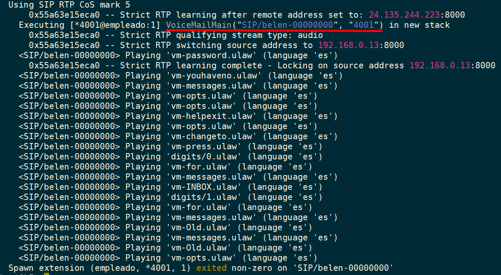
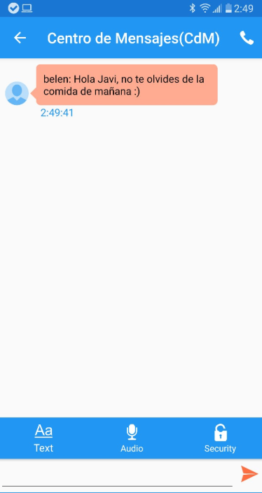
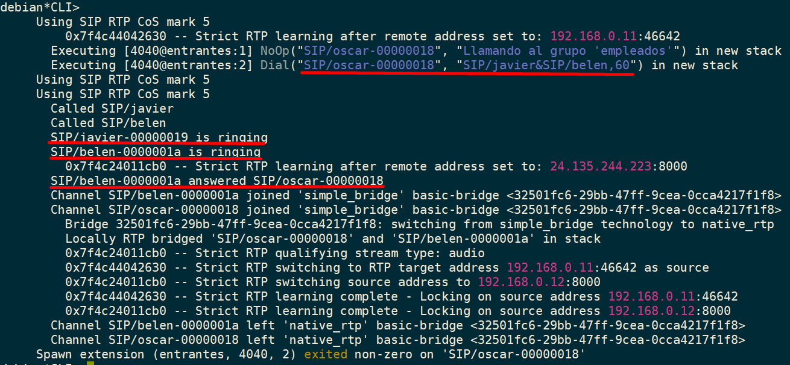
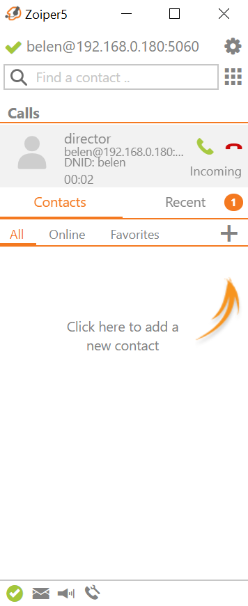
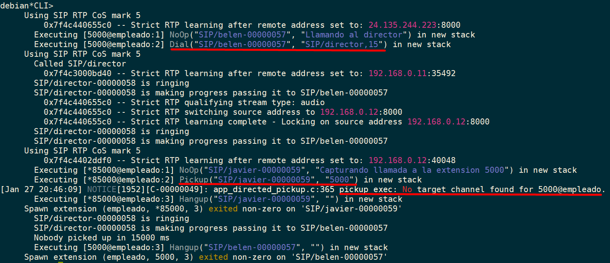
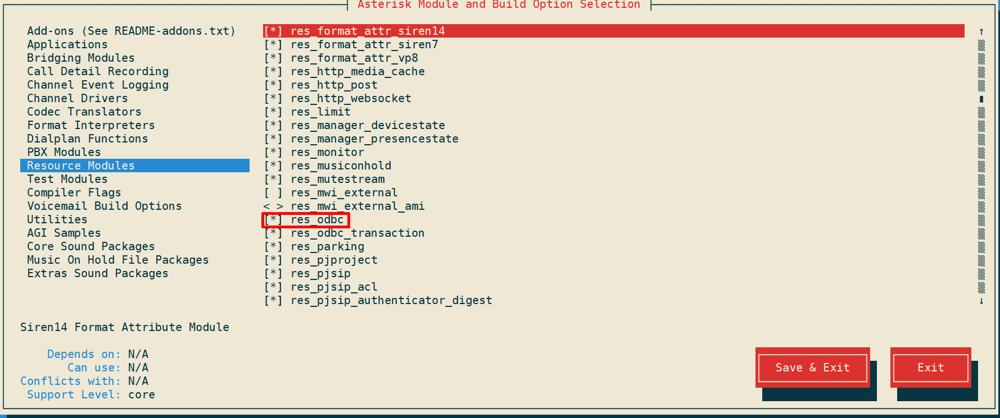
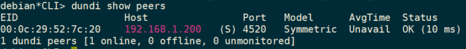

# Asterisk - Instalación y configuración

             _,met$$$$$gg.                                   .$$$$$$$$$$$$$$$=..
          ,g$$$$$$$$$$$$$$$P.                            .$7$7..          .7$$7:.
        ,g$$P""       """Y$$.".                        .$$:.                 ,$7.7
       ,$$P'              `$$$.                       .$7.     7$$$$          .$$77
      ',$$P       ,ggs.     `$$b:                  ..$$.       $$$$$           .$$$7
      `d$$'     ,$P"'   .    $$$                ..7$  .?.   $$$$$  .?.       7$$$.
       Y$$.    `.`"Y$$$$P"'                     $.$.   .$$$7. $$$$7 .7$$$.      .$$$.
       $$P      d$'     ,    $$P              .777.   .$$$$$$77$$$77$$$$$7.      $$$,
       $$:      $$.   -    ,d$$'              $$$~      .7$$$$$$$$$$$$$7.       .$$$.
       $$\;      Y$b._   _,d$P'              .$$7          .7$$$$$$$7:          ?$$$.
       `$$b      "-.__                       $$$         ?7$$$$$$$$$$I        .$$$7
        `Y$$                                $$$      .7$$$$$$$$$$$$$$$$     :$$$.
         `Y$$.       Debian                  $$$      $$$$$$7$$$$$$$$$$$$   .$$$.
           `$$b.                             $$$       $$$  7$$$7  .$$$   .$$$.
             `Y$$b.                          $$$$            $$$$7         .$$$.
                `"Y$b._                      7$$$7            7$$$$      7$$$
                    `""""                    $$$$7.      Asterisk        $$
                                             $$$$$$$.           .  7$$$$$$ $$
                                                 $$$$$$$$$$$$7$$$$$$$$$.$$$$$$
                                                 $$$$$$$$$$$$$$$$.

He desarrollado este tutorial debido a que tenía que hacer uso de **[Asterisk](https://www.asterisk.org/)** en una práctica de la universidad y, ya que tenía que hacer una pequeña memoria, decidí hacerlo en modo tutorial (y no ha quedado tan pequeña :satisfied:). Como he consultado bastantes webs y me ha llevado un tiempo aprender cómo configurar Asterisk (aunque siga siendo un novato), cuelgo el tutorial para que no se quede olvidado en mi ordenador y por si a alguien le puede servir.

Quiero dejar claro que **es la primera vez que configuro una [PBX](https://es.wikipedia.org/wiki/PBX)** como es Asterisk, por lo que **el tutorial puede tener errores y existir seguro mil formas mejor de hacerlo**, pero menos da una piedra, ¿no? :smiley:

 **Si detectas cualquier error, tienes cualquier duda, sugerencia o quieres contactar conmigo puedes hacerlo a través de**

  [](https://es.linkedin.com/in/javierortipriego)          [](https://github.com/javierorp)          [](mailto:javierorp@outlook.com) 


Para hacer esta guía he usando [Typora](https://typora.io/), [Markdown-editor](https://jbt.github.io/markdown-editor/), [gh-md-toc](https://github.com/ekalinin/github-markdown-toc) y [Lightshot](https://app.prntscr.com/es/).


   * [Índice](#asterisk---instalación-y-configuración)
      * [1. Introducción](#1-introducción)
         * [1.1 Nomenclatura](#11-nomenclatura)
         * [1.2 Datos técnicos](#12-datos-técnicos)
      * [2. Conexión SSH con nuestro servidor](#2-conexión-ssh-con-nuestro-servidor)
         * [2.1 Asignación de IP estática](#21-asignación-de-ip-estática)
         * [2.2 Instalación de OpenSSH](#22-instalación-de-openssh)
      * [3.  Instalación de Asterisk](#3--instalación-de-asterisk)
         * [3.1 Programa y dependencias](#31-programa-y-dependencias)
         * [3.2 Creación de un usuario en Asterisk](#32-creación-de-un-usuario-en-asterisk)
         * [3.3 Iniciando Asterisk](#33-iniciando-asterisk)
         * [3.4 Copia de seguridad y adecuación de los ficheros](#34-copia-de-seguridad-y-adecuación-de-los-ficheros)
         * [3.5 Cambio de idioma por defecto de Asterik](#35-cambio-de-idioma-por-defecto-de-asterik)
         * [3.6 Probando la instalación](#36-probando-la-instalación)
      * [4.  Funcionalidades de la PBX](#4--funcionalidades-de-la-pbx)
         * [4.1 Buzón de voz (voicemail)](#41-buzón-de-voz-voicemail)
         * [4.2 Redirección/transferencia de llamadas](#42-redireccióntransferencia-de-llamadas)
         * [4.3 Centro de mensajes (SIP messages)](#43-centro-de-mensajes-sip-messages)
         * [4.4 Llamadas a grupo (call distribution)](#44-llamadas-a-grupo-call-distribution)
         * [4.5 Captura de llamada (call pickup)](#45-captura-de-llamada-call-pickup)
         * [4.6 Conversión de texto a voz (TTS) con Festival](#46-conversión-de-texto-a-voz-tts-con-festival)
         * [4.7  Segurización de llamadas](#47--segurización-de-llamadas)
         * [4.8  Simular llamadas desde el exterior (redirección a un contexto diferente)](#48--simular-llamadas-desde-el-exterior-redirección-a-un-contexto-diferente)
         * [4.9 Horario de atención](#49-horario-de-atención)
         * [4.10 Registro (log)](#410-registro-log)
         * [4.11 Cola y distribución de llamadas](#411-cola-y-distribución-de-llamadas)
      * [5. Integración de Asterisk con MariaDB](#5-integración-de-asterisk-con-mariadb)
         * [5.1 Instalación de MariaDB](#51-instalación-de-mariadb)
         * [5.2 Instalación del conector ODBC](#52-instalación-del-conector-odbc)
         * [5.3 Conexión de Asterisk con MariaDB](#53-conexión-de-asterisk-con-mariadb)
         * [5.4 Probando la conexión](#54-probando-la-conexión)
      * [6. Interconexión con otra PBX usando el módulo DUNDi](#6-interconexión-con-otra-pbx-usando-el-módulo-dundi)
      * [7. Emulación de un Call Center de un Centro de salud](#7-emulación-de-un-call-center-de-un-centro-de-salud)
         * [7.1 Especificaciones](#71-especificaciones)
         * [7.2 Implementación](#72-implementación)
      * [8. Problemas y soluciones](#8-problemas-y-soluciones)
         * [8.1 Unable to connect to remote asterisk (does /var/run/asterisk.ctl exist?)](#81-unable-to-connect-to-remote-asterisk-does-varrunasteriskctl-exist)
      * [9. Softphones](#9-softphones)
      * [10. Bibliografía](#10-bibliografía)
        
      * [11. Enlaces de interés](#11-enlaces-de-interés)


## 1. Introducción

Lo he ido desarrollando en pequeños módulos para que me fuese más fácil entender los conceptos y probar lo integrado, con el objetivo final de desarrollar un [Call Center](#7-emulación-de-un-call-center-de-un-centro-de-salud) con todas las funcionalidades anteriormente probadas.


### 1.1 Nomenclatura

Los comandos a usar, dependiendo de a qué se refieran, van precedidos por un determinado símbolo:

- **$** (dolar): [terminal de Linux](https://maker.pro/linux/tutorial/basic-linux-commands-for-beginners)
```shell
$ [comando]
```
- **:** (dos puntos): [vim](https://www.fprintf.net/vimCheatSheet.html)
```
: [comando]
```
- **CLI>**: [consola de Asterisk](https://openwebinars.net/blog/tutorial-asterisk-cli-command-line-interface/)
```
CLI> [comando]
```
- **MariaDB**: [base de datos MariaDB](https://mariadb.com/kb/en/mariadb-basics/)
```mariadb
MariaDB> [comando]
```
- Si está **citado** significa que es texto plano del archivo a modificar
>Texto del\
>archivo\
>a modificar


Puedes ver el código original, sin modificar,  :file_folder:[aquí](https://github.com/javierorp/Asterisk_Tutorial/tree/master/code/0_originales).

Echa un vistazo a algunos enlaces de interés :link:[aquí](#11-enlaces-de-interés).


### 1.2 Datos técnicos

Haremos uso de [Debian 9.11](https://www.debian.org/releases/stretch/debian-installer/) (GNU bash, versión 4.4.12[1]-release [x86_64-pc-linux-gnu]) sin interfaz gráfica y [Asterisk 15.17.1](http://downloads.asterisk.org/pub/telephony/asterisk/releases/). El sistema operativo se encuentra corriendo en el hipervisor [VMware® Workstation 14 Player](https://www.vmware.com/es/products/workstation-player.html) (14.1.8 build-14921873) con modo de conexión de red ‘Bridged’.

 Al sistema operativo se le ha instalado el programa ‘**sudo**’ para que puedan usarse las opciones de súper usuario como en Ubuntu, haciendo más cómoda la instalación de todas las demás herramientas.

```shell
$ su
```

```shell
$ apt-get install sudo
```

``` shell
$ adduser username sudo
```

## 2. Conexión SSH con nuestro servidor

Puedes ver la bibliografía :books: [aquí](#10-bibliografía).

### 2.1 Asignación de IP estática

Antes de empezar, conviene asignarle una **IP estática** a nuestra interfaz de red para no tener que averiguar cada vez que queramos conectarnos vía SSH qué IP tiene asignada.

Vemos cuál es la IP asignada ahora a la interfaz de la máquina virtual (**ens33**):

```shell
$ ip address
```


Modificamos el **fichero de interfaces**:

```shell
$ sudo vim /etc/network/interfaces
```


Lo modificamos para que sea estática, asignándole la IP **192.168.0.180**:\
:eyes: Ten en cuenta que puede haber errores con la indentación

> \# This file describes the network interfaces available on your system\
> \# and how to activate them. For more information, see interfaces(5).
>
> source /etc/network/interfaces.d/*
>
> \# The loopback network interface\
> auto lo\
> iface lo inet loopback
>
> \# The primary network interface\
> allow-hotplug ens33\
> iface ens33 inet static\
> &nbsp;&nbsp;&nbsp;&nbsp;address 192.168.1.200\
> &nbsp;&nbsp;&nbsp;&nbsp;gateway 192.168.1.1


Modificamos los servidores DNS para que no tengamos problemas al descargar los paquetes. En este caso vamos a utilizar el de Google (8.8.8.8) y el de Cloudflare (1.1.1.1):

```shell
$ sudo vim /etc/resolv.conf
```

> nameserver 8.8.8.8\
> nameserver 1.1.1.1


Reiniciamos el servicio de red y reiniciamos el SO:

```shell
$ sudo systemctl restart networking
```

```shell
$ sudo reboot
```


Podemos ver que la IP ha sido asignada correctamente:

```shell
$ ip address
```


Hacemos un ping para probar que la configuración funciona y no hay problemas con los servidores DNS:

```shell
$ ping -c3 www.debian.org
```


### 2.2 Instalación de OpenSSH

Para instalar **OpenSSH**, si no se ha instalado junto al SO, se puede usar el siguiente comando:

```shell
$ sudo apt-get install openssh-server
```

 

Para averiguar la IP de nuestra máquina (aunque se recomienda poner una estática para que no haya problemas):	

```shell
$ ip address
```


Accedemos al archivo de configuración para indicar el puerto y la dirección IP de escucha:

```shell
$ sudo nano /etc/ssh/sshd_config
```

> Port 22\
> \#AddressFamily any\
> \#ListenAddress 0.0.0.0\
> ListenAddress 192.168.1.180


 

Con los siguientes comando podemos iniciar, parar, restaurar y ver el estado de la conexión:

```shell
$ sudo /etc/init.d/ssh start
```

```shell
$ sudo /etc/init.d/ssh stop
```

```shell
$ sudo /etc/init.d/ssh restart
```

```shell
$ sudo /etc/init.d/ssh status
```


En nuestra máquina, para conectarnos al servidor donde instalaremos Asterisk, usaremos [**MobaXterm**](https://mobaxterm.mobatek.net/), creando una nueva sesión:


Comprobamos que estamos conectados a nuestro servidor:

```shell
$ ps ax | grep sshd
```


## 3.  Instalación de Asterisk

Puedes ver el código :file_folder:[aquí](https://github.com/javierorp/Asterisk_Tutorial/tree/master/code/3_instalacion_asterisk) y la ​bibliografía :books: [aquí](#10-bibliografía).


### 3.1 Programa y dependencias

Antes de instalar el software Asterisk, debemos asegurarnos de que nuestro **sistema operativo esté actualizado**, para ello ejecutamos los siguientes comandos:

```shell
$ sudo apt update && sudo apt upgrade
```

```shell
$ sudo apt install wget build-essential subversion
```


**Descargamos Asterisk 15.7.1 y descomprimimos** el paquete:

```shell
$ cd /usr/src/
```

```shell
$ sudo wget http://downloads.asterisk.org/pub/telephony/asterisk/releases/asterisk-15.7.1.tar.gz
```

```shell
$ sudo tar zxf asterisk-15.7.1.tar.gz
```


Procedemos a la **instalación de las dependencias** de Asterisk:

```shell
$ cd asterisk-15.7.1/
```

```shell
$ sudo contrib/scripts/get_mp3_source.sh
```

```shell
$ sudo contrib/scripts/install_prereq install
```


Preparamos el **código para compilar**:

```shell
$ sudo ./configure
```


 Una vez finalizado se mostrará lo siguiente:


 

Seleccionamos los **módulos a compilar**:

```shell
$ sudo make menuselect
```


**Compilamos**:

```shell
$ sudo make -j2
```


**Instalamos** Asterisk:

```shell
$ sudo make install
```


Podemos **instalar la documentación** con:

```shell
$ sudo make progdocs
```


Para **instalar los archivos genéricos de configuración***:

```shell
$ sudo make samples
```


Por último, **instalaremos el script de inicio** y **actualizaremos la memoria caché de las bibliotecas compartidas:**

```shell
$ sudo make config
```

```shell
$ sudo ldconfig 
```

 

### 3.2 Creación de un usuario en Asterisk

Como Asterisk se ejecuta como usuario administrador, **crearemos un nuevo usuario** y configuraremos el programa para que se ejecute con el nuevo usuario.

**Crearemos un usuario llamado *asterisk***:

```shell
$ sudo adduser --system --group --home /var/lib/asterisk --no-create-home --gecos "Asterisk PBX" asterisk
```


Abrimos el siguiente archivo y **descomentamos las siguientes líneas**:

```shell
$ sudo vim /etc/default/asterisk
```

> AST_USER="asterisk"\
> AST_GROUP="asterisk"


**Añadimos nuestro nuevo usuario a los grupos *dialout* y *audio***:

```shell
$ sudo usermod -a -G dialout,audio asterisk
```


**Cambiamos la** **propiedad de todos los archivos y directorios** de Asterisk para que el usuario pueda acceder a esos archivos:

```shell
$ sudo chown -R asterisk: /var/{lib,log,run,spool}/asterisk /usr/lib/asterisk /etc/asterisk
```

```shell
$ sudo chmod -R 750 /var/{lib,log,run,spool}/asterisk /usr/lib/asterisk /etc/asterisk
```

 

###  3.3 Iniciando Asterisk

Para **iniciar Asterisk**:

```shell
$ sudo /etc/init.d/asterisk start
```


Para **acceder a las interfaz de comandos de Asterisk (CLI)** ejecutamos (*vvvvvv* es para el modo verboso):

```shell
$ sudo asterisk -rvvvvvvc
```

o

```shell
$ sudo asterisk -r
```


Ya solo queda **habilitar el servicio de Asterisk para iniciarse en el arranque**:

```shell
$ sudo systemctl enable asterisk
```


Además, podemos usar los siguientes comandos para **iniciar, parar, reiniciar, recargar, forzar la recarga y ver el estado**, respectivamente:

```shell
sudo /etc/init.d/asterisk {start|stop|restart|reload|force-reload|status}
```


### 3.4 Copia de seguridad y adecuación de los ficheros

Es conveniente, **antes de empezar** a modificar a fondo los ficheros, que hagamos una **copia de seguridad** de los mismos (sustituir *fichero* por el nombre del archivo que corresponda):

```shell
$ cd /etc/asterisk
```

```shell
$ sudo cp fichero.conf fichero.conf.bck
```


Debido a que tienen muchas líneas de comentarios y puede ser engorroso al modificarlos, **vamos a eliminar los comentarios y las líneas en blanco** a través de la línea de comandos de **vim**:

```shell
$ sudo vim /etc/asterisk/fichero.conf
```

Las siguientes expresiones regulares a usar son (la primera para eliminar comentarios y la segunda líneas vacías):

```
: g/^\s*;/d
```

```
: g/^$/d
```

Para **guardar**:

```
: wq
```


### 3.5 Cambio de idioma por defecto de Asterik

Por otro lado, vamos a **configurar el idioma por defecto de Asterisk**, que viene con los sonidos en inglés, por lo que instalaremos también los de castellano.

Los sonidos se encuentran en la carpeta **/var/lib/asterisk/sounds/** y, antes de de descargar lo sonidos en español, debemos **crear una carpeta**:

```shell
$ mkdir /var/lib/asterisk/sounds/es
```

**Descargamos** el paquete **core** y **extra**:

```shell
$ cd /var/lib/asterisk/sounds/es
```

```shell
$ wget -O core.zip https://www.asterisksounds.org/es-es/download/asterisk-sounds-core-es-ES-sln16.zip
```

```shell
$ wget -O extra.zip https://www.asterisksounds.org/es-es/download/asterisk-sounds-extra-es-ES-sln16.zip
```

```shell
$ unzip core.zip
```

```shell
$ unzip extra.zip
```

```shell
$ sudo chown -R asterisk.asterisk /var/lib/asterisk/sounds/es
```


**Convertimos los archivos de sonido** a otros formatos para que Asterisk no tenga que hacerlo cuando los use, por lo que necesitamos instalar el programa *sox*:

```shell
$ sudo apt-get install sox
```

**Creamos un script** para convertirlos en bloque:

```shell
$ cd /var/lib/asterisk/sounds/es/
```

```shell
$ sudo vim convertir
```

y copiamos lo siguiente:\

 :eyes: Ten en cuenta que puede haber errores con la indentación

> \#!/bin/bash\
> for a in \$(find . -name '*.sln16'); do\
> &nbsp;&nbsp;sox -t raw -e signed-integer -b 16 -c 1 -r 16k \$a -t gsm -r 8k \`echo \$a|sed "s/.sln16/.gsm/"\`;\\\
> &nbsp;&nbsp;sox -t raw -e signed-integer -b 16 -c 1 -r 16k \$a -t raw -r 8k -e a-law \`echo \$a|sed "s/.sln16/.alaw/"\`;\\\
> &nbsp;&nbsp;sox -t raw -e signed-integer -b 16 -c 1 -r 16k \$a -t raw -r 8k -e mu-law \`echo \$a|sed "s/.sln16/.ulaw/"\`;\\\
> done

**Damos permisos y ejecutamos** el script:

```shell
$ sudo chmod +x convertir
```

```shell
$ sudo ./convertir
```


**Modificamos el fichero sip.conf** para establecer por defecto el lenguaje a español:

> [general]\
> language=es

Y por último, **recargamos sip** desde la consola de Asterisk:

```shell
$ sudo asterisk -rvvvvvvc
```

```
CLI> sip reload
```


### 3.6 Probando la instalación

Vamos a probar que toda la instalación ha ido correctamente con una simple llamada entre dos usuarios, para ellos tenemos que crearlos y dotar de funcionalidad sus extensiones. Utilizaremos los softphone (se explican en el [9. Softphones](#9-softphones)) **Pangolin** en un PC y **ZoiPer** en un teléfono Android. Los archivos a modificar con **sip.conf** y **extensions.conf**, que explicaremos en el siguiente apartado, por ahora solo es una prueba rápida.

**Modificamos el archivo sip.conf** para añadir lo siguiente:

```shell
$ sudo vim /etc/asterisk/sip.conf
```

> [general]\
> port=5060\
> directmedia=no\
> language=es\
> context=public 
>
> [javier]\
> type=friend\
> secret=12345678\
> context=empleado\
> host=dynamic\
> canreinvite=no\
> nat=force_report
>
> [belen]\
> type=friend\
> secret=12345678\
> context=empleado\
> host=dynamic\
> canreinvite=no\
> nat=force_rport,comedia

Donde ***port=5060*** es el puerto donde nos va permitir conectarnos a Asterisk y ***direcmedia=no*** evita que la secuencia de medios RTP vaya directamente del llamante al llamado, ya que muchos dispositivos no lo soportan. ***javier*** y ***belen*** son las dos personas que están habilitadas para llamar, es decir, los nombres de los dispositivos y, bajo ellas, se encuentran algunas directrices como ***type=friend***, para permitir enviar y recibir llamadas y que un usuario(extensión) tenga múltiples teléfonos; ***secrect*** que es la contraseña para conectarse; ***context=empleado***, el contexto al que pertenecen en el plan de marcación; ***host=dynamic***, para que el dispositivo se registre con Asterisk; ***canreinvite=no***, para detener el envío de las invitaciones una vez se ha establecido las llamadas; y ***nat=force_rpot,comedia***, para trabajar según RFC3581 y obligar a trabajar con soporte simétrico RTP, es decir, un cliente SIP usa el mismo socket/puerto para enviar y recibir el flujo de datos RTP.

**Modificamos el fichero extensions.conf**, añadiendo el contexto *empleado*:

```shell
$ sudo vim /etc/asterisk/extensions.conf
```

> [empleado]\
> exten => 4000,1,Dial(SIP/javier)\
> exten => 4001,1,Dial(SIP/belen)

Como vemos, le hemos asignado el puerto 4000 a javier y el 4001 a belen.

A accedemos a la consola de Asterisk y **actualizamos el dialplan y sip**:

```
CLI> dialplan reload
```

```
CLI> sip reload
```


Ahora, ya podemos ir a **Pangolin** e intentar **acceder con el usuario *belen***:


Y desde **ZoiPer con *javier***:


En la consola de Asterisk podemos ver que se han registrado correctamente:


Para llamar basta con **marcar la extensión de la otra persona** en uno de los teléfonos, por ejemplo, *javier* llama a *belén*:


Desde la consola de Asterisk podemos ver la traza de la llamada:


## 4.  Funcionalidades de la PBX

**:pencil2: Todo se realizará utilizando el protocolo SIP.**

Vamos a configurar una serie de serie de servicios (funcionalidades) en un nuestra PBX con un pequeño grupo de usuario para comprobar que todo se implementa correctamente y, en el [apartado 7](##7.-Emulación-de-un-Call-Center-de-un-Centro-de-salud), extenderlo a un Call Center.

Las funcionalidades a implementar son las siguiente:
 + [4.1 Buzón de voz (voicemail)](#41-buzón-de-voz-voicemail)
 + [4.2 Redirección/transferencia de llamadas](#42-redireccióntransferencia-de-llamadas)
 + [4.3 Centro de mensajes (SIP messages)](#43-centro-de-mensajes-sip-messages)
 + [4.4 Llamadas a grupo (call distribution)](#44-llamadas-a-grupo-call-distribution)
 + [4.5 Captura de llamada (call pickup)](#45-captura-de-llamada-call-pickup)
 + [4.6 Conversión de texto a voz (TTS) con Festival](#46-conversión-de-texto-a-voz-tts-con-festival)
 + [4.7  Segurización de llamadas](#47--segurización-de-llamadas)
 + [4.8  Simular llamadas desde el exterior (redirección a un contexto diferente)](#48--simular-llamadas-desde-el-exterior-redirección-a-un-contexto-diferente)
 + [4.9 Horario de atención](#49-horario-de-atención)
 + [4.10 Registro (log)](#410-registro-log)
 + [4.11 Cola y distribución de llamadas](#411-cola-y-distribución-de-llamadas)


### 4.1 Buzón de voz (voicemail)

Vamos a añadir un buzón de voz para que, cuando se llame a una extensión y no responda, se le pueda dejar un mensaje de voz.

Puedes ver el código :file_folder:[aquí](https://github.com/javierorp/Asterisk_Tutorial/tree/master/code/4.1_4.2_buzon_voz_redirec_transf_llamadas) y la bibliografía :books: [aquí](#10-bibliografía).

#### voicemail.conf

Tenemos que modificar el fichero **voicemail.conf**:

```shell
$ sudo vim /etc/asterisk/voicemail.conf
```

Como vemos, tiene varios contextos:


Eliminaremos [other] y nos quedaremos con [default], donde dicha línea

​								1234 => 4242, Example Mailbox, root@localhost

significa lo siguiente:

- **1234**: número del buzón
- **4242**: pin que necesitamos para acceder al buzón
- **Example Mailbox**: nombre del buzón
- **root@localhost**: dirección email donde será enviado el mensaje


Añadimos las nuestras para nuestros usuarios de prueba *javier* y *belén*:

> [default]\
> 4000 => 1234,Javier,javier@ejemplo.com\
> 4001 => 1234,Belen,belen@ejemplo.com


En este caso en número de buzón coinciden con el de las extensiones para que sea más fácil de memoriza, pero no tendrían por qué.

Accedemos a la consola de Asterisk y **recargamos voicemail**:

```
CLI> voicemail reload
```

Podemos ver la configuración cargada:


#### extensions.conf

**Modificamos el fichero extensions.conf:**

```shell
$ sudo vim /etc/asterisk/extensions.conf
```

> [empleado]\
> exten => 4000,1,NoOp(Llamando a Javier)\
> same => n,Dial(SIP/javier,15)\
> same => n,VoiceMail(${EXTEN})\
> same => n,Hangup()
>
> exten => 4001,1,NoOp(Llamando a Belen)\
> same => n,Dial(SIP/belen,15)\
> same => n,VoiceMail(${EXTEN})\
> same => n,Hangup()
>
> exten => *4000,1,VoiceMailMain(4000)\
> same => n,Hangup()
>
> exten => *4001,1,VoiceMailMain(4001)\
> same => n,Hangup()


En número al final de la función *Dial* indica los segundos que va a estar llamando, es decir, a los 15 segundos pasa a la función *VoiceMail* para que dejen un mensaje de voz.

Con **extension,* marcando ese número (asterisco incluido) pueden oír su buzón de voz, para el que se les pedirá la contraseña (pin configurado en *voicemail.conf*)


#### Prueba de funcionamiento

Hacemos la prueba y llamamos desde *javier* a *belén*, donde, tras no cogerlo, nos habla una locución en español que nos dice que podemos dejar un mensaje. En la consola de Asterisk podemos ver toda la traza de la llamada, incluso la locución que aparece.


Comprobamos que el mensaje se ha guardado en 3 codificaciones distintas (wav49, gsm y wav), donde el nombre de la carpeta *default* es el nombre del contexto y *4001* el número del buzón en el fichero *voicemail.conf*:

```shell
$ ls -l /var/spool/asterisk/voicemail/default/4001/INBOX
```


Ahora, desde el número de belén, marcando *4001 e introduciendo su pin (‘1234’), podemos oír su buzón de voz:


La traza la podemos ver en la consola de Asterisk:




### 4.2 Redirección/transferencia de llamadas

La posibilidad de redirigir/transferir llamadas desde a otra extensión recae en el teléfono que utilicemos. Por ello, para probar esta característica, vamos a habilitar una extensión más que lo único que haga es reproducir una canción.

Puedes ver el código :file_folder:[aquí](https://github.com/javierorp/Asterisk_Tutorial/tree/master/code/4.1_4.2_buzon_voz_redirec_transf_llamadas) y la bibliografía :books: [aquí](#10-bibliografía).

#### Añadiendo música personalizada

Para añadir una música personaliza, lo más sencillo es convertirla del formato mp3 a sln16 y luego ejecutar el script que usamos en el apartado [3.5 Cambio de idioma por defecto de Asterik](#35-cambio-de-idioma-por-defecto-de-asterik).

Para **convertir nuestro archivo a sln16** debemos usar el programa *sox*:

```shell
$ sox file.mp3 --type raw --encoding signed-integer --bits 16 --channels 1 --rate 16k file.sln16
```

 

Ahora solo hay que **mover los archivos de audio** obtenidos a la ruta ‘/var/lib/asterisk/sounds/es/[carpeta]’, para lo que, si no los tenemos en la máquina donde se encuentra Aserisk, debemos hacerlo por [SFTP](https://es.wikipedia.org/wiki/SSH_File_Transfer_Protocol). En este caso vamos a utilizar un cliente con mucho reconocimiento como es [FileZilla](https://filezilla-project.org/):


Con esto ya podemos usar nuestro audio personalizado en Asterisk.

 

#### extensions.conf

**Modificamos el fichero extensions.conf** y bajo el conexto *empleado* añadimos:

```shell
$ sudo vim /etc/asterisk/extensions.conf
```

> exten => 100,1,NoOp(Centralita de distribucion de llamadas)\
> same => n,Playback(silence/1)\
> same => n,Playback(mimusica/primavera)\
> same => n,Hangup()

La extensión añadida es la 100. La función *Playback* reproduce los sonidos del directorio ‘/var/lib/asterisk/sounds/es/’. En este caso reproduce un silencio de un segundo de la carpeta ‘/es/silence/’ y posteriormente el sonido ‘primavera’ localizado en ‘es/mimusica’.

 

**Actualizamos el dialpan**:

```
CLI> dialplan reload
```

 

 

#### Prueba de funcionamiento

Vamos a llamar de *belén* a *javier* y posteriormente transferiremos la llamada desde belén para que javier pase a establecer conexión a la extensión 100:

**Llamamos a \*javier\*** y, cuando descuelgue, **pulsamos la tecla** ***transfer\***:


Escribimos la **extensión a la que transferir**, en este caso la 100:


Podemos ver la **traza en la consola de Asterisk**:


Por ejemplo, en Blink, para realizar una transferencia de llamada debemos, una vez hemos descolgado el teléfono, realizar una llamada a la extensión a la que queremos transferir dicha llamada y arrastrar la sesión con la persona que se desea transferir hacia la sesión con la persona a la que se transfiere mientras mantenemos presionada la tecla Alt.


### 4.3 Centro de mensajes (SIP messages)

Asterisk permite enviar mensajes vía SIP, por lo que vamos a crear un centro de mensajes para que los usuarios puedan enviarse texto, pero **no es una mensajería instantánea**.

Puedes ver el código :file_folder:[aquí](https://github.com/javierorp/Asterisk_Tutorial/tree/master/code/4.3_centro_mensajes) y la bibliografía :books: [aquí](#10-bibliografía).

#### sip.conf

**Modificamos el fichero sip.conf:**

```shell
$ sudo vim /etc/asterisk/sip.conf
```

>  *;**-----Para los mensajes-----*\
> accept_outofcall_message=yes\
> outofcall_message_context=mensajes\
> auth_message_requests=yes\
> subscribecontext=suscribir

***outofcall_message_context=mensajes*** y ***subscribecontext=suscribir*** son los contextos referidos al dialplan (*extensions.conf*).

#### extensions.conf

**Modificamos el fichero extensions.conf**:

```shell
$ sudo vim /etc/asterisk/extensions.conf
```

>  [suscribir]\
> exten => 4000,hint,SIP/javier\
> exten => 4001,hint,SIP/belen
>
> [mensajes]\
> exten => _X.,1,NoOp(Mensaje de ${MESSAGE(from)})\
> same => n,NoOp(Mensaje para ${MESSAGE(to)})\
> same => n,NoOp(Cuerpo del mensaje: ${MESSAGE(body)})\
> same => n,Set(dest=${EXTEN})\
> same => n,Set(remitente=${CUT(MESSAGE(from),<,2)})\
> same => n,Set(remitente=${CUT(remitente,@,1)})\
> same => n,Set(remitente=${CUT(remitente,:,2)})\
> same => n,Set(texto=${MESSAGE(body)})\
> same => n,Set(MESSAGE(body)=${remitente}: ${texto})\
> same => n,GotoIf($["${EXTEN}" = "4000"]?4000)\
> same => n,GotoIf($["${EXTEN}" = "4001"]?4001)\
> same => n,MessageSend(${EXTEN}, Centro de Mensajes(CdM))\
> same => n,Noop(Estado del mensaje ${MESSAGE_SEND_STATUS})\
> same => n,GotoIf($["${MESSAGE_SEND_STATUS}" != "SUCCESS"]?fallo,s,1)\
> same => n,Hangup()
>
> exten => 4000,4000,NoOp(Mensaje a Javier)\
> same => n,MessageSend(sip:javier, Centro de Mensajes(CdM))\
> same => n,Noop(Estado del mensaje ${MESSAGE_SEND_STATUS})\
> same => n,GotoIf($["${MESSAGE_SEND_STATUS}" != "SUCCESS"]?fallo,s,1)\
> same => n,Hangup()
>
> exten => 4001,4001,NoOp(Mensaje a Belen)\
> same => n,MessageSend(sip:belen, Centro de Mensajes(CdM))\
> same => n,Noop(Estado del mensaje ${MESSAGE_SEND_STATUS})\
> same => n,GotoIf($["${MESSAGE_SEND_STATUS}" != "SUCCESS"]?fallo,s,1)\
> same => n,Hangup()
>
> [fallo]\
> exten => s,1,Set(MESSAGE(body)=CdM: El mensaje "${texto}" para ${dest} no ha sido enviado)\
> same => n,Set(remit=${CUT(MESSAGE(from),<,2)})\
> same => n,Set(remit=${CUT(remit,@,1)})\
> same => n,MessageSend(${remit},Centro de Mensajes(CdM))\
> same => n,NoOp(Estado del mensaje ${MESSAGE_SEND_STATUS})\
> same => n,Hangup()


Bajo el contexto ***suscribir*** definimos con ‘hint’ a qué nombre de dispositivo hace referencia y en ***mensajes*** todo lo que se hará cuando se vaya a enviar un mensaje.

La **explicación al código añadido** es la siguiente:

+ **_X.**: indica cualquier extensión numérica.

+ **NoOp:** No hace nada en particular, solo escribe los mensajes en la consola de Asterisk.

+ **Set**: sirve para asignar valores a variables.

+ **GotoIf**: te lleva al ‘[[contexto|]extension|]prioridad’ si se cumple la condición.

+ **Hangup:** finaliza la conexión.

Por tanto, **en resumen**, cuando se recibe un mensaje, se obtiene el remitente, que se asigna al cuerpo del mensaje antes del mensaje de texto que el usuario ha mandado, para, posteriormente chequear a qué extensión se ha enviado el mensaje e ir hacia ella. Se manda el mensaje con remitente ‘Centro de Mensajes(CdM)’ y, si ha habido algún fallo se salta al contexto ‘fallo’ que indica al usuario que el mensaje no ha podido ser enviado.

 

Por último, **actualizamos el dialpan y sip**:

```
CLI> dialplan reload
```

```
CLI> sip reload
```

 

#### Prueba de funcionamiento

Enviamos un mensaje de *belén* a *javier,* para lo que hay que marcar la extensión e indicar que queremos mandar un mensaje (depende del softphone que se use):

En el softphone de belén:


 

En el softphone de javier:




 

Mandamos desde javier un mensaje a una extensión que no está configurada: 


 

En la consola de Asterisk podemos ver las trazas:


### 4.4 Llamadas a grupo (call distribution)

No hay que confundirlas con las conferencias, la funcionalidad de una llamada a un grupo radica en que, cuando se marca una extensión, esa misma llamada se replica a varias extensiones para que pueda ser atendida por cualquiera de ellos. El primero que atienda la llamada se queda con ella.

Por ejemplo, una extensión que pertenezca a un departamento y, al marcarla, que suene en todos los terminales de los empleados del departamento.

Puedes ver el código :file_folder:[aquí](https://github.com/javierorp/Asterisk_Tutorial/tree/master/code/4.4_llamadas_grupo) y la bibliografía :books: [aquí](#10-bibliografía).


#### sip.conf

**Modificamos el fichero sip.conf** para añadir una nueva persona a nuestra PBX:

```shell
$ sudo vim /etc/asterisk/sip.conf
```


>  [oscar]\
> type=friend\
> secret=201097\
> context=entrantes\
> host=dynamic\
> canreinvite=no\
> nat=force_rport,comedia


Hemos añadido a *óscar* en el contexto *entrantes*.

 

####  extensions.conf

**Modificamos el fichero extensions.conf:**

```shell
$ sudo vim /etc/asterisk/extensions.conf
```

>  [entrantes]\
> exten => 4040,1,NoOp(Llamando al grupo 'empleados')\
> same => n,Dial(SIP/javier&SIP/belen,60)\
> same => n,Hangup()


De esta forma, cuando se marque el número 4040, la llamada será redirigida a *javier* y *belén* durante 60 segundos. Si durante 60 segundos ninguno de los dos responde, la llamada finalizará.

Por último, **actualizamos el dialpan y sip**:

```
CLI> dialplan reload
```

```
CLI> sip reload
```

 

#### Prueba de funcionamiento

Vamos a llamar desde el terminal de *óscar* a *javier* y *belén* y será ella la que responda a la llamada.

Desde el **teléfono de *óscar***:

​     

 

Desde el **teléfono de *javier***:


Desde el **teléfono de *belén***:          


 

Podemos ver la **traza en la consola de Asterisk**:




### 4.5 Captura de llamada (call pickup)

Esta función permite capturar (“robar”) una llamada a otro terminal que aún no ha sido respondida para recibirla en tu terminal. Es muy útil cuando en un departamento hay muchos terminales y llaman a una extensión en particular, pero no hay nadie en el sitio, por lo que otra persona, en lugar de levantarse e ir a responder, puede hacerlo desde su terminal simplemente marcando un prefijo (en nuestro caso ***8[extensión]**) y el número de la extensión a la que se está llamando.

Para nuestro ejemplo, crearemos un nuevo usuario, *director*, bajo el contexto *dirección* y permitiremos que *javier* y *belén* puedan capturarse llamadas entre ellos, pero no puedan capturar llamadas del director. Por su parte, el director podrá capturar llamadas tanto de belén como de javier.

Puedes ver el código :file_folder:[aquí](https://github.com/javierorp/Asterisk_Tutorial/tree/master/code/4.5_captura_llamadas) y la bibliografía :books: [aquí](#10-bibliografía).


#### features.conf

Localizado en ‘/etc/asterisk/’. No modificaremos este archivo, ya que usaremos las configuración preestablecida, pero en él se encuentra la configuración de características de llamadas de muestra.

Si le echamos un vistazo, podemos ver qué extensión está por defecto para capturar llamadas:

```shell
$ sudo vim /etc/asterisk/features.conf
```


También la podemos ver desde la consola de Asterisk:

```
CLI> features show
```

 


 

#### sip.conf

Creamos el **nuevo usuario *director*** que pertenecerá al contexto *dirección*:

```shell
$ sudo vim /etc/asterisk/sip.conf
```

> [director]\
> type=friend\
> secret=130261\
> context=direccion\
> host=dynamic\
> canreinvite=no\
> nat=force_rport,comedia

 

Ahora debemos **añadir a cada dispositivo los valores *callgroup***, que define el grupo al que pertenece este dispositivo, y ***pickupgroup***, los grupos a los cuales el dispositivo puede capturar las llamadas.

> [javier]\
> type=friend\
> secret=310195\
> context=empleado\
> host=dynamic\
> canreinvite=no\
> nat=force_rport,comedia\
> callgroup=2\
> pickupgroup=2
> 
> [belen]\
> type=friend\
> secret=120995\
> context=empleado\
> host=dynamic\
> canreinvite=no\
> nat=force_rport,comedia\
> callgroup=2\
> pickupgroup=2 
>
> [director]\
> type=friend\
> secret=130261\
> context=direccion\
> host=dynamic\
> canreinvite=no\
> nat=force_rport,comedia\
> callgroup=1\
> pickupgroup=1,2


De esta forma, director (grupo 1) puede capturar llamadas del grupo 1 y del grupo 2, al que pertenecen javier y belén.

 

#### extensions.conf

**Modificamos el fichero extensions.conf:**

```shell
$ sudo vim /etc/asterisk/extensions.conf
```

**Añadimos el contexto *dirección*** y le habilitamos para que pueda llamar a javier y belén:

> [direccion]\
> *;**####-Extensiones habilitadas-####*\
> *;**-----javier*\
> exten => 4000,1,NoOp(Llamando a Javier)\
> same => n,Dial(SIP/javier,15)\
> same => n,VoiceMail(${EXTEN})\
> same => n,Hangup()\
> *;**-----belen*\
> exten => 4001,1,NoOp(Llamando a Belen)\
> same => n,Dial(SIP/belen,15)\
> same => n,VoiceMail(${EXTEN})\
> same => n,Hangup()\
> *;**####-Captura de llamadas-####*\
> exten => _*8.,1,NoOp(Capturando llamada a la extension ${EXTEN:2})\
> same => n,Pickup(${EXTEN:2}@empleado)\
> same => n,Hangup()

Además, cuando se marque *8 seguido de un número capturamos la llamada con la función *Pickup*. 

Esto mismo lo debemos **poner en el contexto *empleado***:

> *;**####-Captura de llamadas-####*\
> exten => _*8.,1,NoOp(Capturando llamada a la extension ${EXTEN:2})\
> same => n,Pickup(${EXTEN:2})\
> same => n,Hangup()


Por último, **actualizamos el dialpan y sip**:

```
CLI> dialplan reload
```

```
CLI> sip reload
```

  

#### Prueba de funcionamiento

Vamos a probar que, cuando se llama a belén, javier puede capturar la llamada:

Desde el **teléfono del belén**:



 

Desde el **teléfono del javier**:


Podemos ver la **traza en la consola de Asterisk**:


 

Esta es la traza en la consola de Asterisk **cuando javier intenta capturar una llamada al director**, lo cual no le está permitido:




### 4.6 Conversión de texto a voz (TTS) con Festival

:warning:Esta implementación se ha realizado después del apartado [5. Integración de Asterisk con MariaDB](#5-integración-de-asterisk-con-mariadb) :warning:

Una de las cosas a las que estamos más habituados cuando llamamos a una centralita (atención al cliente, centro de soporte, etc.) es que nos aparezca una locución que nos informe o nos diga qué número marcar dependiendo de con quién nos interese contactar.

Puedes ver el código :file_folder:[aquí](https://github.com/javierorp/Asterisk_Tutorial/tree/master/code/4.6_conver_texto_voz_festival) y la bibliografía :books: [aquí](#10-bibliografía).


Vamos a implementar un **conversor de texto a vox** (Text-to-Speech, TTS) gratuito llamado [Festival](http://festvox.org/festival/), para lo que **primero debemos instalarlo** en nuestro sistema:

```shell
$ sudo apt-get install festival
```

 Paramos Asterisk:

```shell
$ sudo /etc/init.d/asterisk stop
```

 

#### festival.scm (/usr/share/festival/)

**Modificamos el fichero festival.scm** y añadimos lo siguiente antes de la última línea (*provide ‘festival*):

```shell
$ sudo vim /usr/share/festival/festival.scm
```

 

> (define (tts_textasterisk string mode)\
> (let ((wholeutt (utt.synth (eval (list 'Utterance 'Text string)))))\
> (utt.wave.resample wholeutt 8000)\
> (utt.wave.rescale wholeutt 5)\
> (utt.send.wave.client wholeutt)))

 

 

Reiniciamos el SO:

```shell
$ sudo reboot
```

 

 

#### Creación de un servicio para Festival

Festival debe iniciarse a la vez que el SO, para lo que **debemos de crear un servicio**, ya que no se crea uno por defecto.

**Creamos el servicio:**

```shell
$ sudo vim /etc/systemd/system/festival.service
```

 

**Copiamos lo siguiente y guardamos:**
> Description=Servicio para Festival TTS\
> Wants=network.target\
> After=syslog.target network-online.target
> 
> [Service]\
> Type=simple\
> ExecStart=/usr/bin/festival --server\
> Restart=on-failure\
> RestartSec=10\
> KillMode=process
> 
> [Install]\
> WantedBy=multi-user.target

 

**Recargamos los servicios:**

```shell
$ sudo systemctl daemon-reload
```

 

**Habilitamos el servicio:**

```shell
$ sudo systemctl enable festival.service
```

 

**Reiniciamos y comprobamos** que está activo:

```shell
$ sudo reboot
```

```shell
$ sudo systemctl status festival.service
```

 


 

Podemos iniciar, parar o ver el estado de nuestro servicio de la siguiente forma:

```shell
$ sudo systemctl start|stop|status festival.service
```

 

 

#### Voces en español

Las voces que vamos a usar son de la Junta de Andalucía y se encuentran disponibles en su repositorio de [GitHub](https://github.com/franjvasquezg/festival-spanish-voices).

```shell
$ cd /home/javier/archivos
```

```shell
$ wget https://github.com/franjvasquezg/festival-spanish-voices/archive/master.zip
```

```shell
$ unzip master.zip
```

```shell
$ cd festival-spanish-voices-master/
```

```shell
$ sudo mkdir /usr/share/festival/voices/spanish
```

```shell
$ sudo cp -r JuntaDeAndalucia_es_* /usr/share/festival/voices/spanish/
```

 

Si observamos los archivos descargados hay dos carpetas:

```shell
$ ls -l /usr/share/festival/voices/spanish/
```

 


*JuntaDeAndalucia_es_pa_diphone* se corresponde con la voz masculina y *JuntaDeAndalucia_es_sf_diphone* con la femenina.

#### festival.scm (/etc/) – Voz por defecto

Vamos a **seleccionar en Festival la voz femenina** por defecto:

```shell
$ sudo vim /etc/festival.scm 
```

Y **añadimos esta línea** al final del archivo:

> (set! voice_default 'voice_JuntaDeAndalucia_es_sf_diphone)


 

**Reiniciamos el servicio:**

```shell
$ sudo systemctl restart festival.service
```

 

#### Integración de Asterisk con Festival

Accedemos a nuestro directorio de Asterisk y **lanzamos el menú**:

```shell
$ cd /usr/src/asterisk-15.7.1/
```

```shell
$ sudo make menuselect
```

 

En la pantalla que aparece nos aseguramos de **marcar Applications ​-->​ app_festival** (bajo el apartado *Extended*):


**Guardamos e instalamos:**

```shell
$ sudo make install
```

 

**Iniciamos Asterisk:**

```shell
$ sudo /etc/init.d/asterisk start
```

 

Accedemos a la consola de Asterisk y vemos que se ha instalado la aplicación:

```shell
$ sudo asterisk -rvvvvvvc
```

```
CLI> core show application festival
```

 

 

Si no apareciese nada, habría que cargar el módulo:

```
CLI> module load app_festival.so
```

```
CLI> module show app_festival.so
```

 

#### extensions.conf

Haremos que, cuando se llame a la centralita (extensión 100), se escuche “Va a escuchar un fragmento de la primera de Antonio Vivaldi”. Para ello, modificamos el fichero **extensions.conf**:

```shell
$ sudo vim /etc/asterisk/extensions.conf
```

>  *;**-----centralita*\
> exten => 100,1,NoOp(Centralita de distribucion de llamadas)\
> same => n,NoOp(Esta llamando ${ODBC_info(${CALLERID(number)})})\
> same => n,Festival(Va a escuchar un fragmento de la primavera de Antonio Vivaldi)\
> same => n,Playback(silence/1)\
> same => n,Playback(mimusica/primavera)\
> same => n,Hangup()

 

**Actualizamos** **el dialpan**:

```
CLI> dialplan reload
```


#### Prueba de funcionamiento

Llamamos con el usuario *javier* a la extensión 100 y podemos ver la traza que deja en la consola de Asterisk:


 


### 4.7  Segurización de llamadas

:warning:Esta implementación se ha realizado después del apartado [5. Integración de Asterisk con MariaDB](#5-integración-de-asterisk-con-mariadb) :warning:

Hoy en día una de las principales preocupaciones es la privacidad, por eso es importante que nuestros sistemas sean lo más seguros posibles. Con la intención de hacer algo más seguras nuestras comunicaciones en Asterisk, vamos a implementar el cifrado de llamadas haciendo uso del protocolo [TLS](https://es.wikipedia.org/wiki/Transport_Layer_Security) (*Transport Layer Security* o, en español, seguridad de la capa de transporte).

Puedes ver el código :file_folder:[aquí](https://github.com/javierorp/Asterisk_Tutorial/tree/master/code/4.7_segurizacion_llamadas) y la bibliografía :books: [aquí](#10-bibliografía).


#### Claves (keys)

Lo primero es **crear un directorio** para almacenar nuestras claves:

```shell
$ sudo mkdir /etc/asterisk/keys
```

 

Para crear las claves **usaremos el script *ast_tls_cert*** que Asterisk nos provee. Ahora, **vamos a crear una autoridad de certificación autofirmada y un certificado Asterisk** que nos servirá posteriormente para crear los certificados de los clientes:

```shell
$ cd /usr/src/asterisk-15.7.1/contrib/scripts/
```

```shell
$ sudo ./ast_tls_cert -C 192.168.1.180 -O "Tutorial Asterisk" -d /etc/asterisk/keys
```

 

+ **-C**: definimos nuestro host (DNS o nuestra dirección IP).

+ **-O**: definimos el nombre de nuestra organización.

+ **-d**: el directorio de salida de nuestras claves.

Nos pedirá una frase que debemos recordar, en este caso será “Esto es un tutorial Asterisk”:


 

Vemos que se han generado las claves:

```shell
$ ls -l /etc/asterisk/keys/
```

 


 

Ahora es el turno de generar los certificados para nuestros clientes:

```shell
$ sudo ./ast_tls_cert -m client -c /etc/asterisk/keys/ca.crt -k /etc/asterisk/keys/ca.key -C 192.168.1.180 -O "Tutorial Asterisk" -d /etc/asterisk/keys -o javier
```

 

+ **-m client**: indicamos al script que el certificado es para un cliente y no para un servidor.

+ **-c**: indicamos cuál es la autoridad que usaremos para generar el certificado.

+ **-k**: proporcionamos la clave para la autoridad de certificación que definimos anteriormente.

+ **-C**: definimos el nombre de host o la dirección IP de nuestro teléfono SIP.

+ **-O**: define el nombre de nuestra organización.

+ **-d**: el directorio de salida de nuestras claves.

+ **-o**: el nombre de la clave que estamos generando.

 

Nos pedirá la frase que indicamos anteriormente (“Esto es un tutorial Asterisk”) cuando creamos la autoridad de certificación:


 

Vemos que se ha generado el certificado correctamente:

```shell
$ ls -l /etc/asterisk/keys/
```

 


*javier.crt*  y *javier.pem* son los ficheros que debemos copiar a nuestro teléfono SIP.

 

#### sip.conf

**Modificamos el fichero sip.conf:**

```shell
$ sudo vim /etc/asterisk/sip.conf
```

 Bajo el **contexto *general*** añadimos:

> tlsenable=yes\
> tlsbindaddr=0.0.0.0\
> tlscertfile=/etc/asterisk/keys/asterisk.pem\
> tlscafile=/etc/asterisk/keys/ca.crt\
> tlscipher=ALL\
> tlsclientmethod=tlsv1


Y en ***javier***:

>  [javier]\
> type=friend\
> secret=310195\
> context=empleado\
> host=dynamic\
> canreinvite=no\
> nat=force_rport,comedia\
> callgroup=2\
> pickupgroup=2\
> transport=tls


**Recargamos sip:**

```
CLI> sip reload
```

 


 

Vemos el transporte permitido para usuarios con certificado (TLS) y que no posea certificado (UDP):

```
CLI> sip show peer javier
```

```
CLI> sip show peer belen
```

 


 

#### Prueba de funcionamiento

Utilizaremos el cliente SIP [Blink](http://icanblink.com/):


**Seleccionamos *javier.pem:***


 

Podemos ver que se ha conectado correctamente:

```
CLI> sip show tcp
```

 


 

```
CLI> sip show peers
```


### 4.8  Simular llamadas desde el exterior (redirección a un contexto diferente)

:warning:Esta implementación se ha realizado después del apartado [5. Integración de Asterisk con MariaDB](#5-integración-de-asterisk-con-mariadb) :warning:

Además de las llamadas internas, la principal función de una PBX es permitir las llamadas desde el exterior directamente a una extensión, sin pasar por una centralita que nos redirija, para lo que normalmente se le suele asignar a una empresa un rango para los últimos números finales.

Por ejemplo, ya que en España el plan de marcación es de 9 cifras, vamos a suponer que a nuestra empresa se le asigna en número 995554XXX, es decir, los números comprendidos entre 995554000 y 995554999.

Puedes ver el código :file_folder:[aquí](https://github.com/javierorp/Asterisk_Tutorial/tree/master/code/4.8_simular_llamadas_exterior) y la bibliografía :books: [aquí](#10-bibliografía).

#### sip.conf

**Modificamos el fichero sip.conf** para crear un usuario, que pertenecerá al contexto *entrantes* que será con el que se llamen desde el exterior:

```shell
$ sudo vim /etc/asterisk/sip.conf
```

> [exterior]\
> type=friend\
> secret=123456\
> context=entrantes\
> host=dynamic\
> canreinvite=no\
> nat=force_rport,comedia


#### extensions.conf

**Modificamos el fichero extensions.conf:**

```shell
$ sudo vim /etc/asterisk/extensions.conf
```

 Bajo el contexto ***entrantes*** añadimos:

> *;----redireccion a la extension marcada*\
> exten => _995554XXX,1,Set(extension=${EXTEN:5})\
> same => n,NoOp(Llamando a la extension ${extension})\
> same => n,Goto(empleado,${extension},1)\
> same => n,Hangup()


El código añadido implica que, cuando se llame a un teléfono 995554XXX, se capturen los últimos 4 números (4XXX) como extensión y se redirija al contexto *empleado* a la extensión capturada.


Bajo el contexto ***empleado*** añadimos lo siguiente:

> *;####-Llamadas desde el exterior que no tienen extension asociada-####*\
> exten => _4XXX,1,Answer()\
> same => n,Festival(La extension ${extension} no se encuentra disponible)\
> same => n,Hangup()

Esto implica que, si anteriormente la extensión no tiene ningún dispositivo asociado, se escuchará “La extensión 4XXX no se encuentra disponible”.

 

Por último, **actualizamos el dialpan y sip**:

```
CLI> dialplan reload
```

```
CLI> sip reload
```

 

 

#### Prueba de funcionamiento

Llamamos desde el usuario *exterior* a una **extensión disponible** como es la 4001 (*belen*), marcando 995554001 y vemos la traza que deja en la consola de Asterisk:


Llamamos desde el usuario *exterior* a una **extensión** **no disponible** como es la 4022, marcando 995554022 y vemos la traza que deja en la consola de Asterisk:


### 4.9 Horario de atención

:warning:Esta implementación se ha realizado después del apartado [5. Integración de Asterisk con MariaDB](#5-integración-de-asterisk-con-mariadb) :warning:

Generalmente las compañías no suelen recibir llamadas 24/7, por lo que cuando llamas fuera del horario no hay nadie que te atienda. Por ello, vamos a establecer, para cuando se reciban llamadas del exterior, una condición de horario que te permita seguir con la llamadas cuando esta se ha realizado dentro de las horas establecidas o, en caso contrario, se escuche una locución indicando “En estos momentos no hay nadie que te pueda atender. Nuestro horario es de 8 a 20 horas de lunes a viernes”.

Puedes ver el código :file_folder:[aquí](https://github.com/javierorp/Asterisk_Tutorial/tree/master/code/4.9_horario_atencion) y la bibliografía :books: [aquí](#10-bibliografía).

#### extensions.conf

**Modificamos el fichero extensions.conf:**

```shell
$ sudo vim /etc/asterisk/extensions.conf
```

 Bajo el **contexto *entrantes*** añadimos:

> *;----redireccion a la extension marcada*\
> *;----con horario establecido L-V de 8 a 20h*\
> exten => _995554XXX,1,Set(extension=${EXTEN:5})\
> same => n,NoOp(Llamando a la extension ${extension})\
> same => n,GotoIfTime(8:00-20:00,mon-fri,*,*?empleado,${extension},1)\
> same => n,Festival(En estos momentos no hay nadie que te pueda atender)\
> same => n,Festival(Nuestro horario es de 8 a 20 horas de lunes a viernes)\
> same => n,Hangup()

 

Hemos **sustituido la función *Goto* por *GotoIfTime*** que funciona de la siguiente forma:

GotoIfTime(\<rango de horas\>,\<días de la semana\>,\<días del mes\>,\<meses\>?\[si es verdadero][:si es falso])

 

De tal forma, hemos establecido las hora de 8 a 20 (8:00-20:00), los días de la semana de lunes a vienes (mon-fri), cualquier día del mes (\*) y cualquier mes (\*). Si se corresponde a ese horario salta al contexto *empleado* a la extensión que corresponda., sino prosigue con la locución.

 

Por último, **actualizamos el dialpan**:

```
CLI> dialplan reload
```

 

#### Prueba de funcionamiento

Llamamos desde el usuario *exterior* al teléfono 995554001 (extensión 4001, *belén*) **fuera del horario establecido** (he modificado el código anterior para hacer la prueba) y vemos la traza que deja en la consola de Asterisk:


 

Llamamos desde el usuario *exterior* al teléfono 995554001 (extensión 4001, *belén*) **dentro del horario establecido**  (con el código correctamente) y vemos la traza que deja en la consola de Asterisk:


### 4.10 Registro (log)

:warning:Esta implementación se ha realizado después del apartado [5. Integración de Asterisk con MariaDB](#5-integración-de-asterisk-con-mariadb) :warning:

Todos los sistemas suelen tener un registros (log) donde se guarda lo que sucede y Asterisk no es menos.

Puedes ver el código :file_folder:[aquí](https://github.com/javierorp/Asterisk_Tutorial/tree/master/code/4.10_registro_log) y la bibliografía :books: [aquí](#10-bibliografía).

#### messages

Asterisk posee, además del registro que podemos ver por su consola, un fichero con los datos de las llamadas localizado en ***/var/log/asterisk/*** y con nombre *messages.*

Podemos **ver las últimas líneas del fichero** de la siguiente forma:

```shell
$ tail /var/log/asterisk/messages
```

 


 

Desde la consola de Asterisk podemos **ver la configuración del logger**:

```
CLI> logger show channels
```

 

La consola tiene activado el modo verbose, por lo que nos parecen los registros cuando se hace una llamada, pero en el fichero no quedan registrados.


#### logger.conf

Para que queden registradas todas las llamadas en el fichero *messages*, debemos **añadir al fichero /etc/asterisk/logger.conf el modo *verbose()***:

```shell
$ sudo vim /etc/asterisk/logger.conf 
```
Bajo el contexto ***logfiles***:

> console => notice,warning,error\
> messages => notice,warning,error,verbose(3)


Ahora, recargamos el logger desde la consola de Asterisk y comprobamos que se ha aplicado la configuración:

```
CLI> logger reload
```

```
CLI> logger show channels
```

 


 

:pencil2:No se recomienda tener activado esta configuración durante mucho tiempo, ya que incremente notablemente el tamaño del fichero, por lo que se suele usar de modo puntual para localizar errores.

 

#### Prueba de funcionamiento

Vamos a realizar una llamada y a comprobar que ahora se escribe en el fichero */var/log/asterisk/messages*:

```shell
$ tail -n 15 /var/log/asterisk/messages
```

 


#### Master.csv

Asterisk guarda también un fichero en formato CSV con todos los registros de llamadas. Se encuentra en la ruta */var/log/asterisk/cdr-csv* y lleva por nombre *Master.csv*.

```shell
$ column -s, -t < /var/log/asterisk/cdr-csv/Master.csv | less -#2 -N -S
```

 


### 4.11 Cola y distribución de llamadas

:warning:Esta implementación se ha realizado después del apartado [5. Integración de Asterisk con MariaDB](#5-integración-de-asterisk-con-mariadb) :warning:

Vamos a crear una cola de llamadas para que cuando llamen más personas de las que los operadores puedan atender, permanezcan a la espera hasta ser atendidos. Los operadores serán estáticos, es decir, ya están establecidas qué extensiones serán los operadores.

Puedes ver el código :file_folder:[aquí](https://github.com/javierorp/Asterisk_Tutorial/tree/master/code/4.11_cola_distribucion_llamadas) y la bibliografía :books: [aquí](#10-bibliografía).

#### musiconhold.conf

Vamos a cambiar la música en espera por defecto por la nuestra propia, para ello tenemos que **modificar el fichero *musiconhold.conf* creando un nuevo contexto que se llamará *recepción*** y que apunte a la carpeta donde estaba el sonido *primavera*:

```shell
$ sudo vim /etc/asterisk/musiconhold.conf
```

> [recepcion]\
> mode=files\
> directory=/var/lib/asterisk/sounds/es/mimusica/

 

**Actualizamos moh**  y vemos que se ha cargado correctamente:

```
CLI> moh reload
```

```
CLI> moh show classes
```

 


#### queues.conf

Modificamos el fichero **queues.conf** donde añadiremos el contexto *recepción* al que pertenecerán *javier* y *belén*:

```shell
$ sudo vim /etc/asterisk/queues.conf
```

> [general]\
> persistentmembers = yes\
> monitor-type = MixMonitor 
>
> [recepcion]\
> strategy = leastrecent\
> timeout = 30\
> member => SIP/javier\
> member => SIP/belen


Las estrategia *leastrecent* llama al dispositivo que hace más tiempo que colgó una llamada en esta cola y con *timeout* definimos el tiempo máximo en segundos que se puede llamar al miembro que corresponde al cruzar la cola.

Actualizamos las **colas y visualizamos que se ha cargado correctamente:**

```
CLI> queue reload all
```

```
CLI> queue show recepcion
```

 


 

#### extensions.conf

**Modificamos el fichero extensions.conf:**

```shell
$ sudo vim /etc/asterisk/extensions.conf
```

 

Incluimos **bajo el contexto *empleado*** una nueva extensión, la 4444, que será la que redirija las llamadas a la cola durante 120 segundos:

> *;-----recepcion*\
> exten => 4444,1,NoOp(Recepcion)\
> same => n,Set(CHANNEL(musicclass)=recepcion)\
> same => n,Answer()\
> same => n,Queue(recepcion,,,,120)\
> same => n,Hangup() 


La función Queue tiene diversos parámetros que podemos añadir:

```
CLI> core show application Queue
```

 Queue(queuename[,options[,URL[,announceoverride[,timeout[,AGI[,macro[,gosub[,rule[,position]]]]]]]]])

No hay que confundir el tiempo que va a estar la llamada en la cola (120 segundos) con el tiempo (timeout) del fichero queues.conf, que es el tiempo que durará la llamada a cada miembro disponible.


**Actualizamos el dialpan:**

```
CLI> dialplan reload
```

 

 

#### Prueba de funcionamiento

Llamamos con el dispositivo *exterior* al teléfono 995554444:


Vemos que se cambia la música en espera a la que nosotros establecimos y que se llama a javier cada 30 segundos si no responde, esto es así porque fue belén la última en responder una llamada. Cuando javier indica que está ocupado es entonces cuando la llamada pasa a belén.


## 5. Integración de Asterisk con MariaDB

Una de las opciones que más flexibilidad proporciona a una PBX es la integración con una base de datos, ya que no haría falta modificar el código de la PBX cuando se quieran modificar algunos parámetros (por ejemplo, el nombre de usuario), facilitando enormemente su mantenimiento. 

En este caso, **la base de datos que vamos a instalar será MariaDB**, una bifurcación de MySQL.

Puedes ver el código :file_folder:[aquí](https://github.com/javierorp/Asterisk_Tutorial/tree/master/code/5_integracion_asterisk_mariadb) y la bibliografía :books: [aquí](#10-bibliografía).

### 5.1 Instalación de MariaDB

Nos aseguramos de **actualizar** la lista de paquetes disponibles e **instalar las nuevas versiones** si las hubiera:

```shell
$ sudo apt update
```

```shell
$ sudo apt upgrade
```

 

**Descargamos el paquete** del repositorio:

```shell
$ cd /home/javier/archivos/
```

```shell
$ wget http://repo.mysql.com/mysql-apt-config_0.8.14-1_all.deb
```

 

**Instalamos el paquete:**

```shell
$ sudo dpkg -i mysql-apt-config_0.8.14-1_all.deb
```

 

En la ventana que aparece, tenemos **habilitar si no los estuviera “MySQL Tools & Connectors”**, ya que así se habilitará el odbc que utilizaremos luego para la integración con Asterisk:


 

Una vez haya terminado, **accedemos a la base de datos** para probar que todo ha ido bien:

```shell
$ sudo mysql -u root
```

 


 

#### Cambio de contraseña del usuario ‘root’

Como podemos observar, nos ha dejado entrar al usuario de administración sin ningún tipo de seguridad. Para **establecer una contraseña a nuestro usuario**, dentro de la base de datos:

```mariadb
MariaDB> UPDATE mysql.user SET PASSWORD=PASSWORD('root') WHERE USER='root';
```

```mariadb
MariaDB> flush privileges;
```

 

Donde PASSWORD=PASSWORD('nuestra_nueva_contraseña'), que en este caso, por ser de prueba, va a ser la misma que el nombre de usuario.

 

Ahora, para que siempre nos pida la contraseña para entrar:

```mariadb
MariaDB> UPDATE mysql.user SET plugin = '' WHERE user = 'root';
```

```mariadb
MariaDB> quit; #para salir
```

 

Ya solo tenemos que **reiniciar el servicio** de la base de datos:

```shell
$ sudo systemctl restart mysql
```

 

#### Creación de un usuario para Asterisk

Llevará por **nombre *asterisk* y con contraseña igual al nombre**.

```mariadb
MariaDB> use mysql;
```

```mariadb
MariaDB> CREATE USER 'asterisk'@'localhost' IDENTIFIED BY 'asterisk';
```

```mariadb
MariaDB> select user, host from user;
```

 


 

**Probamos a acceder** con nuestro nuevo usuario:

```shell
$ sudo mysql -u asterisk -p
```

 

 

#### Creación de una nueva base de datos

Vamos a **crear una nueva base de datos** para que pueda ser usada por Asterisk.

Accedemos a la consola de MariaDB:

```shell
$ sudo mysql -u root -p
```

```mariadb
MariaDB> CREATE DATABASE asteriskdb;
```

```mariadb
MariaDB> show databases;
```


 

**Crearemos una tabla llamada *usuarios*** que tendrá dos campos: nombre y extensión.

```mariadb
MariaDB> use asteriskdb;
```

```mariadb
MariaDB> CREATE TABLE usuarios(nombre VARCHAR(15), extension INTEGER);
```

```mariadb
MariaDB> show tables;
```

 

 

**Insertamos los usuarios:**

```mariadb
MariaDB> insert into usuarios values("javier", 4000);
```

```mariadb
MariaDB> insert into usuarios values("belen", 4001);
```

```mariadb
MariaDB> insert into usuarios values("direccion", 5000);
```

```mariadb
MariaDB> select * from usuarios;
```

 

 

**Damos acceso de lectura, inserción, actualización y eliminación de registros a nuestro usuario** al esquema *asteriskdb* para que pueda acceder y modificar el contenido de todas las tablas bajo dicho esquema:

```mariadb
MariaDB> GRANT SELECT, INSERT, UPDATE, DELETE ON asteriskdb.* TO 'asterisk'@'localhost';
```


### 5.2 Instalación del conector ODBC

[ODBC](https://es.wikipedia.org/wiki/Open_Database_Connectivity) (Open DataBase Connectivity) es estándar para proporcionar una API de acceso a las bases de datos desde cualquier aplicación. En nuestro caso vamos a utilizar [unixODBC](http://www.unixodbc.org/).

 


**Instalamos el conector unixODBC:**

```shell
$ sudo apt-get install unixodbc unixodbc-dev
```

 

**Descargamos el conector de MySQL para ODBC y lo descomprimimos.** Podemos buscar la dirección de descarga adecuada para nuestros SO [aquí](https://dev.mysql.com/downloads/connector/odbc/):

```shell
$ wget https://dev.mysql.com/get/Downloads/Connector-ODBC/8.0/mysql-connector-odbc-8.0.19-linux-debian9-x86-64bit.tar.gz
```

```shell
$ tar xvzf mysql-connector-odbc-8.0.19-linux-debian9-x86-64bit.tar.gz
```

 

Entramos en la carpeta y **copiamos los archivos a su ubicación apropiada**:

```shell
$ cd mysql-connector-odbc-8.0.19-linux-debian9-x86-64bit/
```

```shell
$ sudo cp bin/* /usr/local/bin
```

```shell
$ sudo cp lib/* /usr/local/lib
```

 

Por último, **registramos la versión del driver** usando la herramienta ***myodbc-installer***:

```shell
$ sudo myodbc-installer -a -d -n "MySQL ODBC 8.0 Driver" -t "Driver=/usr/local/lib/libmyodbc8w.so"
```

```shell
$ sudo myodbc-installer -a -d -n "MySQL ODBC 8.0" -t "Driver=/usr/local/lib/libmyodbc8a.so"
```

 

Podemos ver que han sido registrados correctamente:

```shell
$ myodbc-installer -d -l
```


 

#### odbcinst.ini

Estos son los **drivers que debemos configurar:**

```shell
$ sudo vim /etc/odbcinst.ini
```

> [MySQL ODBC 8.0]\
> Description  = Driver ODBC ANSI para MySQL\
> Driver    = /usr/local/lib/libmyodbc8a.so\
> Setup     = /usr/local/lib/libmyodbc8S.so\
> FileUsage   = 1\
> UsageCount=1 
>
> [MySQL ODBC 8.0 Driver]\
> Description  = Driver ODBC Unicode para MySQL\
> Driver    = /usr/local/lib/libmyodbc8w.so\
> Setup     = /usr/local/lib/libmyodbc8S.so\
> FileUsage   = 1\
> UsageCount=2

 

#### odbc.ini

Ahora configuramos el siguiente fichero para **crear un identificador de referencia** para usar en Asterisk:

```shell
$ sudo vim /etc/odbc.ini
```

> [asterisk-connector]\
> Description      = Conexcion MySQL a la base de datos 'asteriskdb'\
> Driver        = MySQL ODBC 8.0\
> Database       = asteriskdb\
> Server        = localhost\
> Port         = 3306\
> Socket        = /var/run/mysqld/mysqld.sock


**Probamos que la conexión se realiza sin problemas** (el primer *asterisk* es el nombre de usuario y el segundo la contraseña):

```shell
$ echo "select * from usuarios" | isql -v asterisk-connector asterisk asterisk
```


### 5.3 Conexión de Asterisk con MariaDB

Tenemos que **recompilar Asterisk para usar ODBC**, por lo que vamos a la carpeta donde descomprimimos Asterisk cuando lo descargamos:

```shell
$ cd /usr/src/asterisk-15.7.1/
```

```shell
$ sudo ./configure
```

 

**Lanzamos el menú para seleccionar los siguientes módulos:**

+ Call Detail Recording -> cdr_odbc , cdr_adaptive_odbc
+ Dialplan Functions -> func_odbc, func_realtime
+ PBX Modules -> pbx_realtime
+ Resource Modules -> res_config_odbc , and res_odbc

 

```shell
$ sudo make menuselect
```

 


 





**Pulsamos en “Save & Exit” e instalamos los módulos:**

```shell
$ sudo make install
```

 

#### res_odbc.conf

Una vez instalado, **editamos el fichero res_odbc.conf añadiendo el contexto *asterisk*:**

```shell
$ sudo vim /etc/asterisk/res_odbc.conf
```

> [asterisk]\
> enabled => yes\
> dsn => asterisk-connector\
> username => asterisk\
> password => asterisk\
> pre-connect => yes


Con *enabled* activamos la conexión; *dns* es la referencia a la configuración que habíamos creado; *username* y *password* son el nombre de usuario y la contraseña de acceso a nuestra base de datos; y *pre-connect* para mantener la conexión abierta mientras el módulo está cargado.

Accedemos a la consola de Asterisk y **recargamos el módulo**:

```
CLI> module reload res_odbc.so
```

```
CLI> odbc show
```


### 5.4 Probando la conexión

Vamos a realizar una prueba muy simple, solo para saber que Asterisk puede acceder sin problemas a la base de datos.

Se modificará la extensión 100 para que muestre una traza en la consola que indique “Está llamando {nombre} con extensión {extensión\}”

#### func_odbc.conf

Para ello, **modificamos el fichero func_odbc.conf**, que es donde pondremos las queries a usar en Asterisk:

```shell
$ sudo vim /etc/asterisk/func_odbc.conf
```

> [info]\
> dsn=asterisk\
> readsql=SELECT CONCAT(nombre,\' con extension \', extension) from usuarios WHERE nombre='${SQL_ESC(${ARG1})}'

 

#### extensions.conf

**Modificamos el fichero extensions.conf:**

```shell
$ sudo vim /etc/asterisk/extensions.conf
```

 

Bajo el contexto ***empleado***, en la parte de *centralita*, añadimos la segunda línea:

> *;-----centralita*\
> exten => 100,1,NoOp(Centralita de distribucion de llamadas)\
> same => n,NoOp(Esta llamando ${ODBC_info(${CALLERID(number)})})\
> same => n,Playback(silence/1)\
> same => n,Playback(mimusica/primavera)\
> same => n,Hangup()

 

Recargamos el módulo **func_odbc.so** y **actualizamos el dialpan**:

```
CLI> module reload func_odbc.so
```

```
CLI> dialplan reload
```


Llamamos desde el dispositivo de javier a la centralita que pone música:


De esta forma comprobamos que Asterisk accede perfectamente a la base de datos.


## 6. Interconexión con otra PBX usando el módulo DUNDi

He clonado la máquina virtual con Asterisk en otro ordenador bajo la misma red. La IP asignada a esta nueva máquina es la 192.168.1.200 y he modificado los usuarios, siendo manuel (2000) y maría (2001) en lugar de javier (4000) y belén (4001), aunque se mantienen los mismos contextos. A la máquina con la IP 192.168.1.180 (javier y belén) nos referiremos como PBX180 y a la de 192.168.1.200 (manuel y maría) como PBX200.

Para realizar la conexión entre dos PBX, utilizaremos [DUNDi](http://www.dundi.info/) (*Distributed Universal Number Discovery*), un protocolo de enrutamiento VoIP para compartir el dialplan entre dos sistemas, similar a [ENUM](https://en.wikipedia.org/wiki/Telephone_number_mapping), y las llamadas seguirán usando el protocolo SIP.


Puedes ver el código :file_folder:[aquí](https://github.com/javierorp/Asterisk_Tutorial/tree/master/code/6_interconexion_dos_asterisks) y la bibliografía :books: [aquí](#10-bibliografía).


### extensions.conf

**Modificamos el fichero extensions.conf para ambas máquinas:**

```shell
$ sudo vim /etc/asterisk/extensions.conf
```

<u>En la PBX180:</u>

> *;**####-INI-DUNDI-####*\
> [dundi-priv-canonical]\
> exten => _4XXX,1,Dial(Zap/g1/${EXTEN},20,rtT) 
>
> [dundi-priv-customers] 
>
> [dundi-priv-via-pstn] 
>
> [dundi-priv-local]\
> include => dundi-priv-canonical\
> include => dundi-priv-customers\
> include => dundi-priv-via-pstn 
>
> [dundi-priv-switch]\
> switch => DUNDi/priv> 
>
> [dundi-priv-lookup]\
> include => dundi-priv-local\
> include => dundi-priv-switch 
>
> [macro-dundi-priv]\
> exten => s,1,NoOp(Macro dundi-prinv de PBX180)\
> same => n,Goto(${ARG1},1)\
> include => dundi-priv-lookup\
> *;**####-FIN-DUNDI-####*


<u>En la PBX200:</u>

> *;**####-INI-DUNDI-####*\
> [dundi-priv-canonical]\
> exten => _2XXX,1,Dial(Zap/g1/${EXTEN},20,rtT)
>
> [dundi-priv-customers]
>
> [dundi-priv-via-pstn]
>
> [dundi-priv-local]\
> include => dundi-priv-canonical\
> include => dundi-priv-customers\
> include => dundi-priv-via-pstn 
>
> [dundi-priv-switch]\
> switch => DUNDi/priv 
>
> [dundi-priv-lookup]\
> include => dundi-priv-local\
> include => dundi-priv-switch 
>
> [macro-dundi-priv]\
> exten => s,1,NoOp(Macro dundi-prinv de PBX200)\
> same => n,Goto(${ARG1},1)\
> include => dundi-priv-lookup\
> *;**####-FIN-DUNDI-####*


**En ambas PBXs, bajo el contexto *empleado* añadimos:**

> *;**####-Conexion DUNDi-####*\
> exten => _99999XXXX,1,NoOP(Llamando a ${EXTEN} - ${EXTEN:5})\
> same => n,Macro(dundi-priv,${EXTEN:5})


De esta forma, cuando marquemos la extensión precedida por 99999 conducirá a la macro *dundi-priv* que conectará con la otra PBX.


### sip.conf

**Modificamos el fichero sip.conf en ambas PBXs:**

```shell
$ sudo vim /etc/asterisk/sip.conf
```

> [priv]\
> type=peer\
> context=dundi-priv-local\
> disallow=all\
> allow=ilbc


### Creación de las claves públicas y privadas

**Accedemos a */var/lib/asterisk/keysk*, lanzamos el programa *astgenkey* y copiamos la clave pública en la otra máquina.** Aunque es altamente recomendable ponerle una contraseña, en este caso no lo vamos a hacer.

<u>En la PBX180:</u>

```shell
$ cd /var/lib/asterisk/keys
```

```shell
$ sudo astgenkey -n PBX180
```

```shell
$ sudo scp PBX180.pub javier@192.168.1.200:/var/lib/asterisk/keys
```

```shell
$ ls -l
```


<u>En la PBX200:</u>

```shell
$ cd /var/lib/asterisk/keys
```

```shell
$ sudo astgenkey -n PBX200
```

```shell
$ sudo scp PBX180.pub javier@192.168.1.180:/var/lib/asterisk/keys
```


### dundi.conf

**Modificamos el fichero dundi.conf:**

```shell
$ sudo vim /etc/asterisk/dundi.conf
```

<u>En la PBX180:</u>

> [general]\
> ttl=32\
> autokill=yes 
>
> [mappings]\
> priv => dundi-priv-canonical,0,SIP,192.168.1.180/${NUMBER},nopartial\
> priv => dundi-priv-customers,100,SIP,192.168.1.180/${NUMBER},nopartial\
> priv => dundi-priv-via-pstn,400,SIP,192.168.1.180/${NUMBER},nopartial 
>
> [00:0C:29:52:7C:20] *;**Direccion MAC de la PBX200*\
> model = symmetric\
> host = 192.168.1.200 *;**IP de la PBX200*\
> inkey = PBX200 *;**Clave publica de la PBX200*\
> outkey = PBX180 *;**Clave privada de la PBC180*\
> include = priv\
> permit = priv\
> qualify = yes\
> order = primary


<u>En la PBX200:</u>

> [general]\
> ttl=32\
> autokill=yes
>
> [mappings]\
> priv => dundi-priv-canonical,0,SIP,192.168.1.200/${NUMBER},nopartial\
> priv => dundi-priv-customers,100,SIP,192.168.1.200/${NUMBER},nopartial\
> priv => dundi-priv-via-pstn,400,SIP,192.168.1.200/${NUMBER},nopartial 
>
> [00:0C:29:CB:EB:C6] *;**Direccion MAC de la PBX180*\
> model = symmetric\
> host = 192.168.1.180 *;**IP de la PBX180*\
> inkey = PBX180 *;**Clave publica de la PBX180*\
> outkey = PBX200 *;**Clave privada de la PBX200*\
> include = priv\
> permit = priv\
> qualify = yes\
> order = primary


**En cada PBX debemos de poner la dirección MAC de la interfaz de red de la otra PBX**, para averiguarla:

```shell
$ ip a
```

Se encuentra junto a la etiqueta *ether:*


Por último, **<u>en cada máquina</u>, actualizamos el dialpan, sip y los módulos**:

```
CLI> dialplan reload
```

```
CLI> sip reload
```

```
CLI> module reload pbx_dundi.so
```

```
CLI> module reload res_crypto.so
```


Podemos ver que las claves se han cargado correctamente las claves:

```
CLI> keys show
```


Y los módulos:

```
CLI> dundi show mappings
```


```
CLI> dundi show peers
```




### Prueba de funcionamiento

Para ver que la conexión se realiza correctamente:

<u>En la PBX180:</u>

```
CLI> dundi lookup 2000@priv bypass
```

 

 

<u>En la PBX200:</u>

```
CLI> dundi lookup 4000@priv bypas
```

 


Ahora llamamos de *javier* (PBX180) a *maría* (PBX200)y vemos las trazas en la consola de Asterisk.

<u>En la PBX180:</u>

 

 

<u>En la PBX200:</u>

 

 

 


## 7. Emulación de un Call Center de un Centro de salud

Vamos a emular el Call Center de un Centro de salud, para lo que eliminaremos las implementaciones anteriores, dejando los archivos nuevos lo más limpios posibles. No iremos paso por paso, sino que se muestran las especificaciones y **todas las implementaciones ya realizadas se encuentran en la carpeta *7_call_center***.

Puedes ver el código :file_folder:[aquí](https://github.com/javierorp/Asterisk_Tutorial/tree/master/code/7_call_center) y la bibliografía :books: [aquí](#10-bibliografía).

### 7.1 Especificaciones


+ El teléfono del centro es el 757112233.

	+ El horario de atención del centro será de 08:00 a 20:00 de lunes a viernes.

	+ Si se llama fuera del horario se escuchará una locución que indique que el centro está cerrado y el horario de apertura.

+ Cuando un usuario llama se le pedirá que pulse 1 si está registrado o 2 si no lo está.

	+ Si está registrado se le pedirá que marque su número de identificación y se verificará en la base de datos.

	+ Si no lo está pasa directamente a recepción.

	+ Se escuchará música mientras espera a que le atiendan.

+ Habrá 3 agentes de recepción para los usuarios registrados y 1 para los no registrados.

	+ La distribución será *leastrecent*, es decir, se llama al dispositivo que hace más tiempo que colgó una llamada de la cola.

	+ Serán los encargados de pasar la llamada a los diferentes equipos.

+ Los dispositivos se identificarán por su extensión y el nombre asociado al dispositivo se encontrará en la base de datos (asteriskdb).

+ Existirán 4 equipos: recepción (1XX), dirección (2XX), doctores (3XX) y enfermería (4XX) que pueden llamarse. Todos tendrán:

	+ Certificado.

	+ Buzón de voz, accesible con *[extensión] y como clave su número de identificación.

	+ Podrán capturar llamadas dentro de su equipo, excepto dirección que podrán capturar llamadas de cualquier equipo.

	+ Podrán llamar a números de fuera del centro.

+ Todos los equipos tendrán habilitadas la primera extensión (X00) para la llamada a grupo de todos los componentes del equipo.

+ Podrán enviarse mensajes (no mensajería instantánea).

+ Base de datos [tabla(columnas)]:

	+ *personal(extensión, nombre, equipo, id)*: personal del centro de salud con su extensión asociada, equipo al que pertenece y su identificación.
+ *usuarios*(*nombre, id*): personas que pertenecen al centro de salud.

### 7.2 Implementación

Aquí están los archivos principales, para ver todos los ficheros :file_folder:[aquí](https://github.com/javierorp/Asterisk_Tutorial/tree/master/code/7_call_center)

#### sip.conf

> [general]\
> port=5060\
> directmedia=no\
> language=es\
> context=public                  ; Default context for incoming calls. Defaults to 'default'\
> allowoverlap=no                 ; Disable overlap dialing support. (Default is yes)\
> udpbindaddr=0.0.0.0             ; IP address to bind UDP listen socket to (0.0.0.0 binds to all)\
> tcpenable=no                    ; Enable server for incoming TCP connections (default is no)\
> tcpbindaddr=0.0.0.0             ; IP address for TCP server to bind to (0.0.0.0 binds to all interfaces)\
> transport=udp                   ; Set the default transports.  The order determines the primary default transport.\
> srvlookup=yes                   ; Enable DNS SRV lookups on outbound calls\
> tlsenable=yes\
> tlsbindaddr=0.0.0.0\
> tlscertfile=/etc/asterisk/keys/asterisk.pem\
> tlscafile=/etc/asterisk/keys/ca.crt\
> tlscipher=ALL\
> tlsclientmethod=tlsv1\
> ;-----Para los mensajes-----\
> accept_outofcall_message=yes\
> outofcall_message_context=mensajes\
> auth_message_requests=yes\
> subscribecontext=suscribir\
> \
> ;-----Recepcion-----\
> [101]\
> type=friend\
> secret=100101\
> context=recepcion\
> host=dynamic\
> canreinvite=no\
> nat=force_rport,comedia\
> callgroup=1\
> pickupgroup=1\
> transport=tls\
> \
> [102]\
> type=friend\
> secret=100102\
> context=recepcion\
> host=dynamic\
> canreinvite=no\
> nat=force_rport,comedia\
> callgroup=1\
> pickupgroup=1\
> transport=tls\
> \
> [103]\
> type=friend\
> secret=100103\
> context=recepcion\
> host=dynamic\
> canreinvite=no\
> nat=force_rport,comedia\
> callgroup=1\
> pickupgroup=1\
> transport=tls\
> \
> [110]\
> type=friend\
> secret=100110\
> context=recepcion\
> host=dynamic\
> canreinvite=no\
> nat=force_rport,comedia\
> callgroup=1\
> pickupgroup=1\
> transport=tls\
> \
> ;-----Direccion-----\
> [201]\
> type=friend\
> secret=200201\
> context=direccion\
> host=dynamic\
> canreinvite=no\
> nat=force_rport,comedia\
> callgroup=2\
> pickupgroup=1-4\
> transport=tls\
> \
> [202]\
> type=friend\
> secret=200202\
> context=direccion\
> host=dynamic\
> canreinvite=no\
> nat=force_rport,comedia\
> callgroup=2\
> pickupgroup=1-4\
> transport=tls\
> \
> [203]\
> type=friend\
> secret=200203\
> context=direccion\
> host=dynamic\
> canreinvite=no\
> nat=force_rport,comedia\
> callgroup=2\
> pickupgroup=1-4\
> transport=tls\
> \
> ;-----Doctores-----\
> [301]\
> type=friend\
> secret=300301\
> context=doctores\
> host=dynamic\
> canreinvite=no\
> nat=force_rport,comedia\
> callgroup=3\
> pickupgroup=3\
> transport=tls\
> \
> [302]\
> type=friend\
> secret=300302\
> context=doctores\
> host=dynamic\
> canreinvite=no\
> nat=force_rport,comedia\
> callgroup=3\
> pickupgroup=3\
> transport=tls\
> \
> [303]\
> type=friend\
> secret=300303\
> context=doctores\
> host=dynamic\
> canreinvite=no\
> nat=force_rport,comedia\
> callgroup=3\
> pickupgroup=3\
> transport=tls\
> \
> ;-----Enfermeria-----\
> [401]\
> type=friend\
> secret=400401\
> context=enfermeria\
> host=dynamic\
> canreinvite=no\
> nat=force_rport,comedia\
> callgroup=4\
> pickupgroup=4\
> transport=tls\
> \
> [402]\
> type=friend\
> secret=400402\
> context=enfermeria\
> host=dynamic\
> canreinvite=no\
> nat=force_rport,comedia\
> callgroup=4\
> pickupgroup=4\
> transport=tls\
> \
> [403]\
> type=friend\
> secret=400403\
> context=enfermeria\
> host=dynamic\
> canreinvite=no\
> nat=force_rport,comedia\
> callgroup=4\
> pickupgroup=4\
> transport=tls\
> \
> ;-----Exterior-----\
> [exterior]\
> type=friend\
> secret=123456\
> context=exterior\
> host=dynamic\
> canreinvite=no\
> nat=force_rport,comedia\
> \
> ;-----Para la conexion con otra PBX-----\
> [priv]\
> type=peer\
> context=dundi-priv-local\
> disallow=all\
> allow=ilbc


#### extensions.conf

> [general]\
> static=yes\
> writeprotect=no\
> clearglobalvars=no\
> \
> [public]\
> include => exterior\
> \
> ;####-INI-LLAMADAS-####\
> [exterior]\
> ;redireccion a la extension marcada\
> ;con horario establecido L-V de 8 a 20h\
> exten => 757112233,1,GotoIfTime(8:00-20:00,mon-fri,\*,\*?abierto,1,1)\
> same => n,Festival(En estos momentos no hay nadie que te pueda atender)\
> same => n,Festival(Nuestro horario es de 8 a 20 horas de lunes a viernes)\
> same => n,Hangup()\
> \
> [abierto]\
> ;el centro de salud esta abierto\
> exten => 1,1,Answer()\
> same => n,Festival(Bienvenido al centro de salud)\
> same => n(loop),Festival(Presione)\
> same => n,SayNumber(1)\
> same => n,Festival(si es un usuario registrado o)\
> same => n,SayNumber(2)\
> same => n,Festival(en caso contrario)\
> same => n,Read(opcion,,1,3)\
> same => n,SayNumber(${opcion})\
> same => n,GotoIf($["${opcion}" = "1"]?10,1)\
> same => n,GotoIf($["${opcion}" = "2"]?20,1)\
> same => n,Festival(Opcion incorrecta)\
> same => n,Goto(1,loop)\
> same => n,Hangup()\
> ;usuario registrado\
> exten => 10,1(id),Festival(Por favor marque su numero de identificacion o presione)\
> same => n,SayNumber(9)\
> same => n,Festival(para volver al menu)\
> same => n,Read(id,,4,3,5)\
> same => n,SayNumber(${id})\
> same => n,GotoIf($["${id}" = "9"]?1,loop)\
> same => n,Set(nombre=${ODBC_usuario(${id})})\
> same => n,GotoIf($["${nombre}" != ""]?recepcion,1,1)\
> same => n,Festival(Usario no encontrado)\
> same => n,Goto(10,id)\
> same => n,Hangup()\
> ;usuario sin registrar\
> exten => 20,1,Goto(recepcion,2,1)\
> same => n,Hangup()\
> \
> [recepcion]\
> ;llamada a grupo\
> exten => _X00,1,Festival(Llamada a grupo ${EXTEN})\
> same => n,Goto(llamar-grupo,${EXTEN},1)\
> same => n,Hangup()\
> ;usuarios registrados\
> exten => 1,1,Set(CHANNEL(musicclass)=recepcion)\
> same => n,Answer()\
> same => n,Festival(Hola ${nombre})\
> same => n(reg),Festival(Por favor espere a que le atiendan)\
> same => n,Queue(registrados,,,,60)\
> same => n,Goto(1,reg)\
> same => n,Hangup()\
> ;usuarios no registrados\
> exten => 2,1,Set(CHANNEL(musicclass)=recepcion)\
> same => n,Answer()\
> same => n(noreg),Festival(Por favor espere a que le atiendan)\
> same => n,Queue(noregistrados,,,,60)\
> same => n,Goto(2,noreg)\
> same => n,Hangup()\
> ;llamada a otra extension\
> exten => _XXX,1,Set(extension=${EXTEN})\
> same => n,Set(nombre=${ODBC_extension(${extension})})\
> same => n,GotoIf($["${nombre}" != ""]?llamar,${extension},1)\
> same => n,Festival(La extension ${extension} no se encuentra disponible)\
> same => n,Hangup()\
> ;buzon de voz\
> exten => _*XXX,1,Set(llamante=${CALLERID(num)})\
> same => n,Goto(buzon-voz,1,1)\
> same => n,Hangup()\
> ;captura de llamada\
> exten =>  _*8.,1,Set(extension=${EXTEN:2})\
> same => n,Set(pref=${extension:0:1})\
> same => n,GotoIf($["${pref}" = "1"]?llamar,8,1)\
> same => n,Festival(No tiene permiso para capturar una llamada a la extension ${extension})\
> same => n,Hangup()\
> ;llamada a exterior\
> exten => _XXXXXXXXX,1,Goto(llamar,${EXTEN},1))\
> same => n,Hangup()\
> ;telefono no reconocido\
> exten => _X!,1,Festival(El telefono o extension)\
> same => n,SayNumber(${EXTEN})\
> same => n,Festival(es incorrecto)\
> same => n,Hangup()\
> \
> [direccion]\
> ;llamada a grupo\
> exten => _X00,1,Festival(Llamada a grupo ${EXTEN})\
> same => n,Goto(llamar-grupo,${EXTEN},1)\
> same => n,Hangup()\
> ;llamada a otra extension\
> exten => _XXX,1,Set(extension=${EXTEN})\
> same => n,Set(nombre=${ODBC_extension(${extension})})\
> same => n,GotoIf($["${nombre}" != ""]?llamar,${extension},1)\
> same => n,Festival(La extension ${extension} no se encuentra disponible)\
> same => n,Hangup()\
> ;buzon de voz\
> exten => _*XXX,1,Set(llamante=${CALLERID(num)})\
> same => n,Goto(buzon-voz,1,1)\
> same => n,Hangup()\
> ;captura de llamada\
> exten =>  _*8.,1,Set(extension=${EXTEN:2})\
> same => n,Goto(llamar,8,1)\
> same => n,Hangup()\
> ;llamada a exterior\
> exten => _XXXXXXXXX,1,Goto(llamar,${EXTEN},1))\
> same => n,Hangup()\
> ;telefono no reconocido\
> exten => _X!,1,Festival(El telefono o extension)\
> same => n,SayNumber(${EXTEN})\
> same => n,Festival(es incorrecto)\
> same => n,Hangup()\
> \
> [doctores]\
> ;llamada a grupo\
> exten => _X00,1,Festival(Llamada a grupo ${EXTEN})\
> same => n,Goto(llamar-grupo,${EXTEN},1)\
> same => n,Hangup()\
> ;llamada a otra extension\
> exten => _XXX,1,Set(extension=${EXTEN})\
> same => n,Set(nombre=${ODBC_extension(${extension})})\
> same => n,GotoIf($["${nombre}" != ""]?llamar,${extension},1)\
> same => n,Festival(La extension ${extension} no se encuentra disponible)\
> same => n,Hangup()\
> ;buzon de voz\
> exten => _*XXX,1,Set(llamante=${CALLERID(num)})\
> same => n,Goto(buzon-voz,1,1)\
> same => n,Hangup()\
> ;captura de llamada\
> exten =>  _*8.,1,Set(extension=${EXTEN:2})\
> same => n,Set(pref=${extension:0:1})\
> same => n,GotoIf($["${pref}" = "3"]?llamar,8,1)\
> same => n,Festival(No tiene permiso para capturar una llamada a la extension ${extension})\
> same => n,Hangup()\
> ;llamada a exterior\
> exten => _XXXXXXXXX,1,Goto(llamar,${EXTEN},1))\
> same => n,Hangup()\
> ;telefono no reconocido\
> exten => _X!,1,Festival(El telefono o extension)\
> same => n,SayNumber(${EXTEN})\
> same => n,Festival(es incorrecto)\
> same => n,Hangup()\
> \
> [enfermeria]\
> ;llamada a grupo\
> exten => _X00,1,Festival(Llamada a grupo ${EXTEN})\
> same => n,Goto(llamar-grupo,${EXTEN},1)\
> same => n,Hangup()\
> ;llamada a otra extension\
> exten => _XXX,1,Set(extension=${EXTEN})\
> same => n,Set(nombre=${ODBC_extension(${extension})})\
> same => n,GotoIf($["${nombre}" != ""]?llamar,${extension},1)\
> same => n,Festival(La extension ${extension} no se encuentra disponible)\
> same => n,Hangup()\
> ;buzon de voz\
> exten => _*XXX,1,Set(llamante=${CALLERID(num)})\
> same => n,Goto(buzon-voz,1,1)\
> same => n,Hangup()\
> ;captura de llamada\
> exten =>  _*8.,1,Set(extension=${EXTEN:2})\
> same => n,Set(pref=${extension:0:1})\
> same => n,GotoIf($["${pref}" = "4"]?llamar,8,1)\
> same => n,Festival(No tiene permiso para capturar una llamada a la extension ${extension})\
> same => n,Hangup()\
> ;llamada a exterior\
> exten => _XXXXXXXXX,1,Goto(llamar,${EXTEN},1))\
> same => n,Hangup()\
> ;telefono no reconocido\
> exten => _X!,1,Festival(El telefono o extension)\
> same => n,SayNumber(${EXTEN})\
> same => n,Festival(es incorrecto)\
> same => n,Hangup()\
> \
> [llamar]\
> ;llamada a otra extension\
> exten => _XXX,1,Festival(Llamando a ${nombre})\
> same => n,Dial(SIP/${extension},15)\
> same => n,VoiceMail(${extension})\
> same => n,Hangup()\
> ;captura de llamada\
> exten => 8,1,Festival(Capturando llamada a la extension ${extension})\
> same => n,Set(equipo=${ODBC_equipo(${extension})})\
> same => n,Pickup(${extension}@${equipo})\
> same => n,Hangup()\
> ;conexion DUNDi\
> exten => _XXXXXXXXX,1,Macro(dundi-priv,${EXTEN:5})\
> same => n,Hangup()\
> \
> [llamar-grupo]\
> ;recepcion\
> exten => 100,1,Dial(SIP/101&SIP/102&SIP/103&SIP/110,60))\
> same => n,Hangup()\
> ;;direccion\
> exten => 200,1,Dial(SIP/201&SIP/202&SIP/203,60)))\
> same => n,Hangup()\
> ;;doctores\
> exten => 300,1,Dial(SIP/301&SIP/302&SIP/303,60)))\
> same => n,Hangup()\
> ;enfermeros\
> exten => 400,1,Dial(SIP/401&SIP/402&SIP/403,60)))\
> same => n,Hangup()\
> ;otra\
> exten => s,1,Festival(Grupo ${extension} no se encuentra disponible)\
> same => n,Hangup()\
> \
> [buzon-voz]\
> exten => 1,1,Festival(Para acceder a su buzon de voz)\
> same => n(pin),Festival(Marque su numero de identificacion privado)\
> same => n,Read(pin,,4,3,5)\
> same => n,Set(idpin=${ODBC_pin(${llamante})})\
> same => n,GotoIf($["${pin}" = "${idpin}"]?2,1)\
> same => n,Festival(Numero de identificacion erroneo)\
> same => n,Goto(1,pin)\
> same => n,Hangup()\
> \
> exten => 2,1,Festival(Marque 1 para continuar)\
> same => n,VoiceMailMain(${llamante})\
> same => n,Hangup()\
> ;####-FIN-LLAMADAS-####\
> \
> ;####-INI-MENSAJES-####\
> [suscribir]\
> exten => 101,hint,SIP/101\
> exten => 102,hint,SIP/102\
> exten => 103,hint,SIP/103\
> exten => 110,hint,SIP/110\
> exten => 201,hint,SIP/201\
> exten => 202,hint,SIP/202\
> exten => 203,hint,SIP/203\
> exten => 301,hint,SIP/301\
> exten => 302,hint,SIP/302\
> exten => 303,hint,SIP/303\
> exten => 401,hint,SIP/401\
> exten => 402,hint,SIP/402\
> exten => 403,hint,SIP/403\
> \
> [mensajes]\
> exten => _X.,1,Set(dest=${EXTEN})\
> same => n,Set(remitente=${CUT(MESSAGE(from),<,2)})\
> same => n,Set(remitente=${CUT(remitente,@,1)})\
> same => n,Set(remitente=${CUT(remitente,:,2)})\
> same => n,Set(texto=${MESSAGE(body)})\
> same => n,Set(MESSAGE(body)=${remitente}: ${texto})\
> same => n,Set(nombre=${ODBC_extension(${remitente})})\
> same => n,Set(nombre=${IF($[ "${nombre}" = ""]?desconocido)})\
> same => n,MessageSend(sip:${dest}, Centro de Mensajes(CdM))\
> same => n,Noop(Estado del mensaje ${MESSAGE_SEND_STATUS})\
> same => n,GotoIf($["${MESSAGE_SEND_STATUS}" != "SUCCESS"]?fallo,s,1)\
> same => n,Hangup()\
> \
> [fallo]\
> exten => s,1,Set(MESSAGE(body)=CdM: El mensaje "${texto}" para ${dest} no ha sido enviado)\
> same => n,Set(remit=${CUT(MESSAGE(from),<,2)})\
> same => n,Set(remit=${CUT(remit,@,1)})\
> same => n,MessageSend(${remit},Centro de Mensajes(CdM))\
> same => n,NoOp(Estado del mensaje ${MESSAGE_SEND_STATUS})\
> same => n,Hangup()\
> ;####-FIN-MENSAJES-####\
> \
> ;####-INI-DUNDI-####\
> [dundi-priv-canonical]\
> exten => _XXXXXXXXX,1,Dial(Zap/g1/${EXTEN:6},20,rtT)\
> \
> [dundi-priv-customers]\
> \
> [dundi-priv-via-pstn]\
> \
> [dundi-priv-local]\
> include => dundi-priv-canonical\
> include => dundi-priv-customers\
> include => dundi-priv-via-pstn\
> \
> [dundi-priv-switch]\
> switch => DUNDi/priv\
> \
> [dundi-priv-lookup]\
> include => dundi-priv-local\
> include => dundi-priv-switch\
> \
> [macro-dundi-priv]\
> exten => s,1,NoOp(Macro dundi-prinv de PBX180)\
> same => n,Goto(${ARG1},1)\
> include => dundi-priv-lookup\
> ;####-FIN-DUNDI-####


#### queues.conf

> [general]\
> persistentmembers = yes\
> monitor-type = MixMonitor\
> \
> [registrados]\
> strategy = leastrecent\
> timeout = 30\
> member => SIP/101\
> member => SIP/102\
> member => SIP/103\
> \
> [noregistrados]\
> strategy = leastrecent\
> timeout = 30\
> member => SIP/110

#### func_odbc.conf

> [general]\
> \
> [SQL]\
> dsn=mysql1\
> readsql=${ARG1}\
> \
> [ANTIGF]\
> dsn=mysql1,mysql2   ; Use mysql1 as the primary handle, but fall back to mysql2\
> readsql=SELECT COUNT(*) FROM exgirlfriends WHERE callerid='${SQL_ESC(${ARG1})}'\
> syntax=\<callerid\>\
> synopsis=Check if a specified callerid is contained in the ex-gf database\
> \
> [PRESENCE]\
> dsn=mysql1\
> readsql=SELECT location FROM presence WHERE id='${SQL_ESC(${ARG1})}'\
> writesql=UPDATE presence SET location='${SQL_ESC(${VAL1})}' WHERE id='${SQL_ESC(${ARG1})}'\
> \
> [info]\
> dsn=asterisk\
> readsql=SELECT CONCAT(nombre,' con extension ', extension) from usuarios WHERE nombre='${SQL_ESC(${ARG1})}'\
> \
> [usuario]\
> dsn=asterisk\
> readsql=SELECT nombre from usuarios WHERE id='${SQL_ESC(${ARG1})}'\
> \
> [extension]\
> dsn=asterisk\
> readsql=SELECT nombre from personal where extension='${SQL_ESC(${ARG1})}'\
> \
> [pin]\
> dsn=asterisk\
> readsql=SELECT id from personal where extension='${SQL_ESC(${ARG1})}'\
> \
> [equipo]\
> dsn=asterisk\
> readsql=SELECT lower(equipo) from personal where extension='${SQL_ESC(${ARG1})}'

#### voicemail.conf

> [general]\
> format=wav49|gsm|wav\
> serveremail=asterisk\
> attach=yes\
> skipms=3000\
> maxsilence=10\
> silencethreshold=128\
> maxlogins=3\
> emaildateformat=%A, %B %d, %Y at %r\
> pagerdateformat=%A, %B %d, %Y at %r\
> sendvoicemail=yes ; Allow the user to compose and send a voicemail while inside\
> \
> [zonemessages]\
> eastern=America/New_York|'vm-received' Q 'digits/at' IMp\
> central=America/Chicago|'vm-received' Q 'digits/at' IMp\
> central24=America/Chicago|'vm-received' q 'digits/at' H N 'hours'\
> military=Zulu|'vm-received' q 'digits/at' H N 'hours' 'phonetic/z_p'\
> european=Europe/Copenhagen|'vm-received' a d b 'digits/at' HM\
> \
> [default]\
> ;;para entrar se verificara en el dialplan y la clave\
> ;coincidira con el id de la tabla personal\
> 101 => 1,101,101@centrosalud.es\
> 102 => 1,102,102@centrosalud.es\
> 103 => 1,103,103@centrosalud.es\
> 110 => 1,110,110@centrosalud.es\
> 201 => 1,201,201@centrosalud.es\
> 202 => 1,202,202@centrosalud.es\
> 203 => 1,203,203@centrosalud.es\
> 301 => 1,301,301@centrosalud.es\
> 302 => 1,302,302@centrosalud.es\
> 303 => 1,303,303@centrosalud.es\
> 401 => 1,401,401@centrosalud.es\
> 402 => 1,402,402@centrosalud.es\
> 403 => 1,403,403@centrosalud.es 

#### script.sql


> CREATE TABLE personal(extension INTEGER NOT NULL, nombre VARCHAR(20) NOT NULL, equipo VARCHAR(10) NOT NULL, id INTEGER NOT NULL, PRIMARY KEY (id));\
> CREATE TABLE usuarios(nombre VARCHAR(20) NOT NULL, id INTEGER NOT NULL, PRIMARY KEY (id));\
> \
> \
> insert into personal values(101, "MARIA", "RECEPCION", 1001);\
> insert into personal values(102, "IGNACIO", "RECEPCION", 1002);\
> insert into personal values(103, "MANUEL", "RECEPCION", 1003);\
> insert into personal values(110, "CRISTINA", "RECEPCION", 1004);\
> insert into personal values(201, "BELEN", "DIRECCION", 2001);\
> insert into personal values(202, "JAVIER", "DIRECCION",2002);\
> insert into personal values(203, "OSCAR", "DIRECCION", 2003);\
> insert into personal values(301, "LAURA", "DOCTORES", 3001);\
> insert into personal values(302, "ANA", "DOCTORES", 3002);\
> insert into personal values(303, "JORGE", "DOCTORES", 3003);\
> insert into personal values(401, "ISABEL", "ENFERMERIA", 4001);\
> insert into personal values(402, "ANTONIO", "ENFERMERIA", 4002);\
> insert into personal values(403, "RAQUEL", "ENFERMERIA", 4003);\
> \
> \
> insert into usuarios values("JULIA", 50);\
> insert into usuarios values("MARIO", 51);\
> insert into usuarios values("PAULA", 52);\
> insert into usuarios values("NATIVIDAD", 53);\
> insert into usuarios values("MARIA JESUS", 54);\
> insert into usuarios values("MANUEL", 55);\
> insert into usuarios values("JUAN", 56);\
> insert into usuarios values("CARLOS", 57);\
> insert into usuarios values("GRACIA", 58);\
> insert into usuarios values("AMELIA", 59);\
> \
> GRANT SELECT, INSERT, UPDATE, DELETE ON asteriskdb.* TO 'asterisk'@'localhost';


## 8. Problemas y soluciones

Puedes ver la bibliografía :books: [aquí](#10-bibliografía).

### 8.1 Unable to connect to remote asterisk (does /var/run/asterisk.ctl exist?)

Cuando te aparece este error al lazar la consola de Asterisk, lo más probable es que se deba a problemas de permisos con el usuario *asterisk*. Para solucionarlo:

```shell
$ sudo chown -R asterisk: /var/{lib,log,run,spool}/asterisk /usr/lib/asterisk /etc/asterisk
```

```shell
$ sudo chmod -R 750 /var/{lib,log,run,spool}/asterisk /usr/lib/asterisk /etc/asterisk
```

 

Y reiniciar el sistemas operativo.

```shell
$ sudo reboot
```


Si con eso no funcionara, podemos lanzarlo manualmente con:

```shell
$ sudo asterisk -&
```


## 9. Softphones

Un softphone (combinación de *software* y *telephone*) es un software utilizado para comunicaciones VoIP, ya sea entre softphones o a un hardphones (teléfonos físicos para comunicaciones VoIP). Vienen a ser muy útiles porque podemos probar en local, sin necesidad de hardware adicional (que suelen tener un precio elevado), las funcionalidad de la PBX. Aunque hay infinidad de ellos, yo he probado los siguiente:

+ [Pangolin](https://sip-system.com/en/pc/20-pangolin.html): disponible para Windows, tiene una desventaja clave y es la inestabilidad. Es gratuito.

+ [ZoiPer](https://www.zoiper.com/): disponible para todo tipo de plataformas, ya sean de escritorio o de smartphone, es bastante estable y fácil de utilizar. Es gratuito para realizar llamadas, pero otras funcionalidades más avanzadas son de pago.

+ [3CX](https://www.3cx.es/voip-telefono/softphone/): disponible solo para Windows, es rápido, estable, sencillo y cómodo de usar. Simula uno de los primeros iPhone. Es gratuito.

+ [Blink](http://icanblink.com/): disponible para Windows, es cómodo de usar sobre todo cuando tienes que utilizar certificados. Es gratuito.

+ [Sipnetic](https://play.google.com/store/apps/details?id=com.sipnetic.app): disponible para Android, me ha parecido el cliente SIP más cómodo de usar en el smartphone. Es gratuito para realizar llamadas y enviar mensajes, pero otras funcionalidades más avanzadas son de pago.

+ [MizuDroid](https://play.google.com/store/apps/details?id=com.mizuvoip.mizudroid.app&hl=es_419): disponible para Android, es útil cuando tienes que enviar mensajes ya que lo implementa 


## 10. Bibliografía

Como en mi tierra dicen *es de bien nacidos ser agradecidos*, aquí están todas los recursos gracias a los cuales he podido desarrollar todo, punto por punto:

- ##### **2. Conexión SSH con nuestro servidor**
  
	- ###### 2.1 Asignación de IP estática

		1\. [Rackspace](https://support.rackspace.com/how-to/changing-dns-settings-on-linux/)

		2\. [Snel](https://www.snel.com/support/how-to-configure-static-ip-on-debian-10/)
	
	- ###### 2.2 Instalación de OpenSSH
	
		3\. [phoenixNAP](https://phoenixnap.com/kb/how-to-enable-ssh-on-debian)

 

- ##### **3. Instalación de Asterisk**

	- ###### 3.1 Programa y dependencias

		4\. [pascom GmbH & Co. KG (YouTube)](https://www.youtube.com/watch?v=dyfaFu2yn78&feature=youtu.be)

	- ###### 3.6 Probando la instalación

		5\. [pascom GmbH & Co. KG (YouTube)](https://www.youtube.com/watch?v=do_4HbBXv4k&feature=youtu.be)

		6\. [Academia Abierta De Ingeniería Electrónica](http://edutronic.blogspot.com/2013/07/realizacion-de-llamadas-con-asterisk.html)

 

- ##### **4. Funcionalidades de la PBX**

	- ###### 4.1 Buzón de correo (voicemail)

		7\. [pascom GmbH & Co. KG (YouTube)](https://www.youtube.com/watch?v=gBAx421MlJ4&feature=youtu.be)

		8\. [pascom GmbH & Co. KG (YouTube)](https://www.youtube.com/watch?v=nBXX5b6bepw&feature=youtu.be)

		9\. [pascom GmbH & Co. KG (YouTube)](https://www.youtube.com/watch?v=tlYm1Hjq7M0&feature=youtu.be)

	- ###### 4.2 Redirección/transferencia de llamadas

		10\. [minestron](https://www.minestron.it/asterisk/convertir-archivos-de-audio-para-asterisk)

	- ###### 4.3 Centro de mensajes (SIP messages)

		11\. [VozToVoice](https://www.voztovoice.org/?q=node/549)

	- ###### 4.4 Llamadas a grupo (call distribution)

		12\. [pascom](https://www.pascom.net/en/blog/asterisk-tutorial-20-asterisk-call-distribution/)

	- ###### 4.5 Captura de llamada (call pickup)

		13\. [VozToVoice](https://www.voztovoice.org/?q=node/350)

	- ###### 4.6 Conversión de texto a voz (TTS) con Festival

		14\. [Computingforgeeks](https://computingforgeeks.com/how-to-install-and-configure-festival-for-asterisk-use/)

		15\. [Tim Leland](https://timleland.com/how-to-run-a-linux-program-on-startup/)

		16\. [Cabot Development Team (GitHub)](https://github.com/RealCabot/hci_node/wiki/Change-default-festival-voice)

	- ###### 4.7 Segurización de llamadas

		17\. [Wiki Asterisk](https://wiki.asterisk.org/wiki/display/AST/Secure+Calling+Tutorial#SecureCallingTutorial-ConfiguringaTLS-enabledSIPclienttotalktoAsterisk)

	- ###### 4.8 Simular llamadas desde el exterior (redirección a un contexto diferente)

		18\. [pascom GmbH & Co. KG (YouTube)](https://www.youtube.com/watch?v=lxC5QXEBnfg&list=PLnzEbgyK52Gu9fdVDHburrsG3KBIntXFK&index=11&t=0s)

	- ###### 4.9 Horario de atención

		19\. [pascom GmbH & Co. KG (YouTube)](https://www.youtube.com/watch?v=oJcNEZdPr98&list=PLnzEbgyK52Gu9fdVDHburrsG3KBIntXFK&index=14)

	- ###### 4.10 Registro (log)

		20\. [pascom GmbH & Co. KG (YouTube)](https://www.youtube.com/watch?v=I5UXF8GEZy8&list=PLnzEbgyK52Gu9fdVDHburrsG3KBIntXFK&index=52&t=0s)

		21\. [Stack Overflow](https://stackoverflow.com/questions/1875305/command-line-csv-viewer)

	- ###### 4.11 Cola y distribución de llamadas

		22\. [pascom GmbH & Co. KG (YouTube)](https://www.youtube.com/watch?v=FFIwE4KGzis&t=606s)

		23\. [Asterisk Wiki](https://www.wikiasterisk.com/index.php/Colas#Configuraci.C3.B3n_Especifica_de_las_Colas)

 

- ##### **5. Integración de Asterisk con MySQL/MariaDB**
  
	- ###### 5.1 Instalación de MySQL/MariaDB
		
		24\. [TecAdmin](https://tecadmin.net/install-mysql-server-on-debian9-stretch/)

		25\. [Robbi Nespu](https://robbinespu.github.io/eng/2018/03/29/Reset_mariadb_root_password.html)

		26\. [Rackspace](https://support.rackspace.com/how-to/mysql-resetting-a-lost-mysql-root-password/)
		
	- ###### 5.2 Instalación del conector ODBC
		
		27\. [Dev MySQL](https://dev.mysql.com/doc/connector-odbc/en/connector-odbc-installation-binary-unix-tarball.html)
	- ###### 5.3 Conexión de Asterisk con MariaDB
	
		28\. [OpenWebinars](https://openwebinars.net/blog/configurar-asterisk-para-trabajar-con-mysql-usando-odbc-2-de-3/)
	- ###### 5.4 Probando la conexión
	
		29\. [OpenWebinars](https://openwebinars.net/blog/configurar-asterisk-para-trabajar-con-mysql-usando-odbc-3-de-3/)
	


- ##### **6. Interconexión con otra PBX usando el módulo DUNDi**
  
	- ###### Todo
		
		30\. [VozToVoice](https://www.voztovoice.org/?q=node/239)

		31\. [ElastixTech](https://elastixtech.com/protocolo-dundi/)

- ##### **7. Emulación de un Call Center de un Centro de salud**
  
	- ###### Todo
		
		32\. [VOIP-Info](https://www.voip-info.org/asterisk-dialplan-patterns/)

		33\. [Asterisk Wiki](https://wiki.asterisk.org/wiki/display/AST/Manipulating+Variables+Basics)
		
		34\. [The Asterisk Book](http://the-asterisk-book.com/1.6/applikationen-read.html)


- ##### **8. Problemas y soluciones**
  
	- ###### 8.1 Unable to connect to remote asterisk (does /var/run/asterisk.ctl exist?):

		35\. [Asterisk community](https://community.asterisk.org/t/asterisk-unable-to-connect-to-remote-asterisk-does-var-run-asterisk-ctl-exist/66100)


## 11. Enlaces de interés

+ [Asterisk The Definite Guide](https://bit.ly/2Hi7HNW)

+ [VOIP-Info](https://www.voip-info.org/)

+ [Asterisk Wiki](https://wiki.asterisk.org/wiki/display/AST/Home)

+ [Asterisk community](https://community.asterisk.org)

+ [pascom GmbH & Co. KG - Asterisk Tutorials](https://www.youtube.com/watch?v=jMQfSsO1da4&list=PLnzEbgyK52Gu9fdVDHburrsG3KBIntXFK)

+ [Vim](https://www.fprintf.net/vimCheatSheet.html)

+ [FileZilla](https://filezilla-project.org/)

+ [MobaXterm](https://mobaxterm.mobatek.net/)

+ [Visual Studio Code](https://code.visualstudio.com/)

